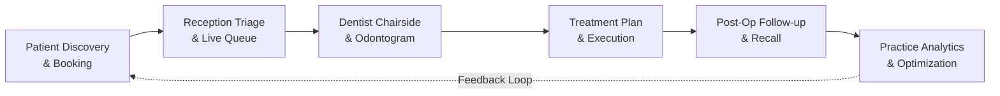

# 00. Dental Square — Product Foundation & Clinic Identity

---

## 1. Executive Summary

**Dental Square** is an established, high-reputation dental healthcare practice located in Lalpur, Ranchi, Jharkhand, India. This document establishes the architectural, operational, clinical, and user experience foundation for **Digital Dental Square** — a unified digital platform encompassing patient engagement, clinic operations, chairside dental workflows, treatment tracking, and practice intelligence.

The platform is purpose-built for the reality of a modern multi-specialty dental practice. It intentionally rejects the bloated complexity of generic hospital information management systems (HIMS), the impersonal abstractions of standard CRMs, and the visual noise of decorative SaaS dashboards.

---

## 2. Real Clinic Context & Physical Identity

Digital Dental Square is not an abstract concept; it is the digital extension of a physical clinic operating at:

```
Dental Square
1st Floor, Amravati Complex (Above ICICI Bank)
Near BIT Extension Center, Circular Road, Lalpur
Ranchi, Jharkhand 834001, India
Phone: +91 98869 82522
Google Rating: 4.9 ★ (90+ Verified Patient Reviews)
```

### 2.1 Key Practitioners & Clinical Focus

From the clinic's physical credentials and operatory setup:
- **Dr. Anuj Kumar**, BDS, MDS
  - *Specialization*: Oral & Maxillofacial Surgeon
  - *Affiliation*: Consultant at Medica Superspecialty Hospital
  - *Clinical Scope*: Surgical extractions, impactions, dental implants, maxillofacial trauma, reconstructive surgeries.
- **Dr. Vandana Choudhary**, BDS, MDS
  - *Specialization*: Conservative Dentistry & Endodontics
  - *Clinical Scope*: Advanced Root Canal Treatment (RCT), microscopic endodontics, cosmetic restorations, smile designing, veneers, crowns & bridges.

### 2.2 Physical Environment & Atmosphere Translation

Visual analysis of the physical clinic reveals key architectural and atmospheric cues that must directly inform the digital experience:

| Physical Feature Observed | Real Clinic Characteristic | Translation into Digital UX |
| :--- | :--- | :--- |
| **Reception & Lounge** | Polished teak wood finishes, soft warm cove lighting, frosted glass partitions with Dental Square branding, clean leatherette waiting lounge. | Calm, warm off-white surfaces, deep charcoal typography, subtle borders, welcoming non-sterile tone. No cold hospital blues. |
| **Operatories (1 & 2)** | Advanced ergonomic dental chairs with periwinkle/slate blue upholstery, overhead dental surgical microscope, chairside digital monitors, integrated delivery units, dark slate cuspidor bowls. | Clean operatory view mode, high-contrast tooth charts, dark slate and muted teal accents, instant visual status indicators for active procedures. |
| **Sterilization & Cabinets** | Clean recessed cabinetry, visible autoclave/UV sterilizer units, organized instruments. | Transparent hygiene/safety badges for patients; clean, structured clinical logging for doctors. |
| **Exterior & Signage** | Aluminum composite panel (ACP) facade with deep royal blue lettering: "DENTAL SQUARE" and emblem featuring concentric blue arches forming a tooth silhouette with green vitality leaves at the base. | Brand identity anchored in deep royal navy (`#0F2C59`) and restorative teal (`#0D5C58`), with leaf-green micro accents (`#10B981`). |
| **360° Virtual Presence** | Existing Google Street View / Business View multi-node 360° tour covering exterior, reception, consultation desk, and both treatment operatories. | "Explore Dental Square" / 360° clinic experience retained as a key patient website concept. In production, this will utilize an authorized/approved integration or asset; supplied materials serve as design/context references. |

---

## 3. Core Product Vision & MVP Scope Control

```
"One connected digital experience for the entire dental clinic."
```

Digital Dental Square bridges the divide between the patient's external journey and the clinic's internal operational reality. Rather than relying on fragmented tools (paper registers, separate appointment apps, disconnected WhatsApp chats, and spreadsheet accounts), every touchpoint is part of a single continuous flow:



### 3.1 Core Demo Scope vs. Future Modules

To guarantee delivery focus, the system enforces strict scope boundaries:

**Core Demo Scope (Mandatory for Prototypes & Phase Walkthroughs)**:
```
Patient Website 
  → Appointment Booking 
  → Clinic Dashboard 
  → Queue Management 
  → Patient Profile 
  → Clinical / Treatment Workflow 
  → Follow-ups & Recalls 
  → Practice Analytics (with Progressive Drill-Down) 
  → Optional WhatsApp Automation
```

**Future / Optional / Out of Current Demo Scope**:
- Self-service authenticated Patient Portal
- Dedicated Emergency Triage & Emergency Action Overrides
- In-depth Billing, Invoicing & Financial Discharge Ledgers
- Advanced multi-branch or enterprise clinic ERP modules

### 3.2 The Core Operational Pillars

1. **Patient Experience**: Transparent treatment education, doctor credentials, 360° clinic tour preview, effortless appointment booking, and instant confirmations.
2. **Clinic Operations**: Real-time front desk situational awareness, digital token queue, walk-in management, returning patient recognition, and multi-chair coordination.
3. **Dentist Workflow**: Distraction-free chairside interface, interactive FDI odontogram, multi-visit treatment progression, fast clinical notes (SOAP format), and structured prescriptions.
4. **Follow-Up & Retention**: Systematic post-op check-ins, automated treatment continuity alerts (e.g., reminding a patient to place a crown after RCT obturation), and preventive recall triggers.
5. **Practice Analytics**: Clean separation between today's operational pulse and deep strategic intelligence (patient retention, treatment drop-offs, demographic insights).
6. **Communication Layer**: Consent-driven, non-intrusive WhatsApp and SMS notifications with zero spam and complete patient privacy.
7. **Healthcare Privacy & Security**: Privacy and data protection considerations aligned with applicable Indian requirements, subject to formal legal and compliance review before production deployment.

---

## 4. Design Philosophy: Restraint & Clarity

The product experience is governed by three foundational tenets:

### Tenet 1: Apple-Level Simplicity & Restraint
- **Generous Whitespace**: Whitespace is an active design element that creates visual calm and reduces cognitive load in high-stress medical contexts.
- **Strict Hierarchy**: Every screen must have one undeniable focal point, one primary action, and secondary actions tucked behind progressive disclosure.
- **Restrained Color**: Color is never decorative. It carries informational meaning (e.g., green for completed, amber for pending/due, red for active pathology/caries).

### Tenet 2: Dental-Specific Workflow & Terminology
- The system must visibly and functionally feel like a dental clinic, not a generic business tool.
- Information architecture revolves around dental concepts: Teeth, Surfaces, Odontograms, Endodontic Stages, Periodontal Health, Operatory Chairs, and Recall Intervals.
- Generic terms like "Customer", "Ticket", "Lead", and "Deal" are strictly banned.

### Tenet 3: Complexity Underneath, Simplicity on the Surface
- Multi-step dental procedures (e.g., a 4-visit Root Canal Treatment involving access, bio-mechanical preparation, obturation, and crown restoration) must feel effortless and linear to both the doctor and patient, hiding complex data validation behind intuitive stage indicators.

---

## 5. Design Anti-Patterns (What We Will NEVER Build)

To protect the integrity of the product, the following patterns are explicitly prohibited:

```
❌ Generic Hospital HIMS: Endless cascading menus, hundreds of required form fields, cluttered tables with 30 columns, and archaic gray interfaces.
❌ Generic CRM / Lead Pipelines: Kanban boards treating patients as "deals" or "leads", pushy sales funnels, and aggressive spam automation.
❌ Overly Futuristic / Dark Cyberpunk Dashboards: Glowing neon cards, gratuitous glassmorphism, 3D animated teeth spinning on load, and dark sci-fi themes.
❌ Childish Dental Clipart: Cartoon smiling teeth holding toothbrushes, goofy mascot graphics, and dental puns that undermine clinical trust.
❌ Fabricated Data & Medical Claims: Fake 5-star ratings, invented patient testimonials, unauthorized doctor photos, or fabricated clinical success rates.
❌ Overcrowded Dashboards: Cramming 15 charts onto the home screen so the user cannot tell if the clinic is running smoothly today.
```

---

## 6. Separation of Real Clinic Identity vs. Demo Prototype Data

To maintain absolute ethical, legal, and clinical accuracy:

- **Real Clinic Data (Locked & Authorized)**:
  - Clinic Name: Dental Square
  - Physical Address: 1st Floor, Amravati Complex, Lalpur, Ranchi, Jharkhand 834001
  - Verified Doctors: Dr. Anuj Kumar (Oral & Maxillofacial Surgery), Dr. Vandana Choudhary (Conservative Dentistry & Endodontics)
  - Public Phone: +91 98869 82522
  - Brand Palette: Navy (`#0F2C59`), Forest Teal (`#0D5C58`), Operatory Blue (`#4A6FA5`)
  - Real Clinic Architecture & 360° Tour Structure: Preserved as visual and spatial references.
- **Demo / Prototype Data (Strictly Segregated & Fictional)**:
  - All patient names, phone numbers, addresses, and demographic distributions.
  - All appointment volumes, wait time records, and revenue/collection figures.
  - All clinical diagnostic charts, radiographs, and tooth condition records.
  - Any additional doctor or staff names not physically displayed on clinic boards.
  - *Data Isolation*: All mock data will be driven by seed generators with explicit `isDemo: true` flags, allowing seamless cutover to production databases in future phases.
