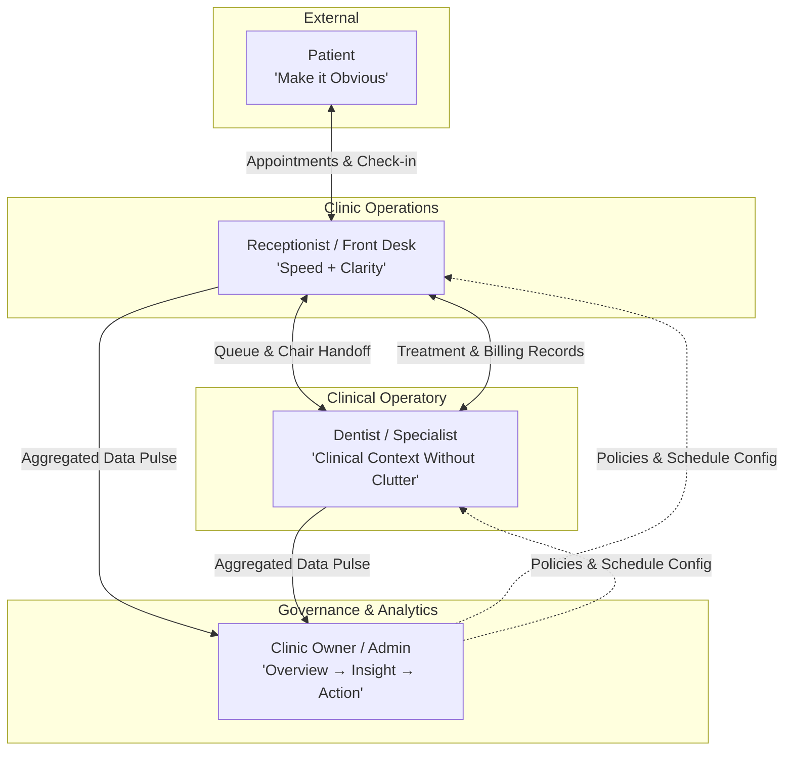

# 01. Dental Square — User Roles & Permissions

---

## 1. Role Architecture Overview

Digital Dental Square serves four primary user roles, each operating with distinct mental models, time constraints, and clinical/operational responsibilities. The system enforces strict role-specific user experiences to ensure that administrative tasks never clutter clinical care, and complex analytics never hinder front desk velocity.



---

## 2. Deep Dive: User Role Profiles

### 2.1 Role A: Patient

```
Guiding Heuristic: "MAKE IT OBVIOUS."
```

#### Profile & Context
- **Who they are**: Individuals seeking routine check-ups, cosmetic enhancement, emergency toothache relief, or complex surgical/endodontic care in Ranchi and surrounding areas.
- **Mental State**: Often anxious about dental pain, needles, procedures, and opaque costs; accessing the platform primarily on mobile devices (smartphones) under variable network conditions.
- **Jobs to be Done (JTBD)**:
  1. Easily evaluate Dental Square's expertise, technology, doctors, and location.
  2. Book an appointment in under 45 seconds without mandatory password creation.
  3. Receive clear, instant appointment confirmations and reminders via WhatsApp/SMS.
  4. Understand post-procedure care instructions and know when the next visit is scheduled.
- **Pain Points with Traditional Dental Clinics**:
  - Unclear pricing and unexpected treatment costs.
  - Long waiting times without visibility into their queue position.
  - Confusing clinical explanations with excessive jargon.
  - Forgetting post-op medication instructions or missing crucial second-visit RCT appointments.
- **UX Rules for Patient Experience**:
  - Zero-friction booking flow: *Doctor → Date & Time → Basic Contact Info → Instant Confirmation*.
  - No required account creation; mobile number verification (OTP/WhatsApp) handles identity.
  - Reassuring visual tone with transparent procedure explanations.

---

### 2.2 Role B: Reception / Front Desk

```
Guiding Heuristic: "SPEED + CLARITY."
```

#### Profile & Context
- **Who they are**: Front desk executive managing patient arrivals, phone calls, walk-ins, doctor schedules, and payments.
- **Operating Environment**: High-interruption environment at the Amravati Complex entrance desk, juggling phone calls, in-person patient greetings, doctor queries, and payment processing simultaneously.
- **Primary Question to Answer**: *"What is happening in the clinic right now?"* (within 3 seconds of glancing at the screen).
- **Jobs to be Done (JTBD)**:
  1. Instantly look up scheduled patients and check them into the waiting queue.
  2. Issue sequential digital queue tokens for both appointments and walk-in arrivals.
  3. Identify returning patients instantly by phone number or name, avoiding duplicate records.
  4. Coordinate operatory readiness (Operatory 1 vs. Operatory 2) with attending doctors.
  5. Handle invoice generation, payment collection, and follow-up visit scheduling.
- **Pain Points with Traditional Dental Systems**:
  - Overly complicated modals requiring 12 fields just to check a patient in.
  - Unclear visibility into whether a doctor is still treating or ready for the next patient.
  - Manual paper tokens causing patient disputes over queue order in the waiting lounge.
- **UX Rules for Reception Experience**:
  - Single-screen Front Desk & Queue Board with live token counters.
  - Fast keyboard shortcuts (e.g., `Ctrl+K` global patient search, `Enter` to check in).
  - High-contrast visual indicators showing patient arrival status and chair occupancy.

---

### 2.3 Role C: Dentist / Doctor (Dr. Anuj Kumar & Dr. Vandana Choudhary)

```
Guiding Heuristic: "CLINICAL CONTEXT WITHOUT CLUTTER."
```

#### Profile & Context
- **Who they are**: Highly specialized clinicians (Oral & Maxillofacial Surgeon; Endodontist & Conservative Dentist) performing precision chairside procedures.
- **Operating Environment**: Operatory room, wearing surgical gloves/loupes, seated next to the patient chair, referencing a chairside tablet or articulated display monitor.
- **Primary Question to Answer**: *"Who is in my chair, what is their clinical history, what are we performing today, and what is next in their treatment plan?"*
- **Jobs to be Done (JTBD)**:
  1. Review today's patient queue and call the next patient into the operatory.
  2. Access the patient's visual tooth chart (FDI Odontogram), previous radiographs, and systemic medical alerts (e.g., hypertension, diabetes, drug allergies) at a glance.
  3. Update tooth status (e.g., mark tooth #26 with pulpitis, or tooth #46 as obturated).
  4. Record rapid SOAP clinical notes (Subjective, Objective, Assessment, Plan) with structured shortcuts.
  5. Generate structured digital prescriptions (Rx) and trigger the next required follow-up visit.
- **Pain Points with Traditional Dental Systems**:
  - Having to click through 6 administrative tabs just to see which tooth was treated last week.
  - Tiny, clunky odontogram widgets requiring mouse-precise clicking of microscopic tooth zones.
  - Slow note-taking that eats into clinical treatment time.
- **UX Rules for Doctor Experience**:
  - Glove-friendly, touch-optimized chairside layout with large clickable dental targets.
  - Instant visual medical alert banner (highlighting allergies or systemic conditions in red/amber).
  - One-click treatment milestone progression (e.g., *Access Opened → Canal Prepared → Obturated → Crown Placed*).

---

### 2.4 Role D: Clinic Owner / Practice Admin

```
Guiding Heuristic: "OVERVIEW → INSIGHT → ACTION."
```

#### Profile & Context
- **Who they are**: Clinic owner/managing partners reviewing practice health, growth, revenue trends, clinical quality, and patient retention.
- **Operating Environment**: Mobile phone in the morning/evening, or laptop during administrative review sessions.
- **Primary Question to Answer**: *"Is the clinic performing well, are patients completing multi-visit treatments, and what bottlenecks need immediate attention?"*
- **Jobs to be Done (JTBD)**:
  1. Inspect the daily clinic pulse (appointments completed, chair utilization).
  2. Triage the "Needs Attention" queue (unconfirmed tomorrow appointments, abandoned RCT journeys, overdue recalls).
  3. Drill down into treatment conversion rates (e.g., percentage of RCT patients who complete their crown restoration).
  4. Analyze patient acquisition sources and demographic reach across Ranchi.
  5. Configure doctor availability and communication templates.
- **Pain Points with Traditional Dental Systems**:
  - Dashboards cluttered with static, vanity numbers that offer no direct path to action.
  - Inability to detect treatment abandonment until revenue has already been lost.
  - Zero distinction between daily operations and deep statistical analysis.
- **UX Rules for Owner Experience**:
  - Concise home dashboard that loads instantly and highlights actionable items.
  - Dedicated Analytics section completely decoupled from daily operations.
  - Every analytical metric provides a direct drill-down link to the affected patient cohort with one-click outreach.

---

## 3. Role-Based Access Control (RBAC) Matrix

To safeguard patient medical privacy, permissions are enforced at the API, controller, and UI route layers. Healthcare privacy and security considerations are aligned with applicable Indian requirements, subject to formal legal/compliance review before production deployment:

| Feature / Domain | Scope Tier | Patient | Reception / Front Desk | Dentist / Specialist | Clinic Owner / Admin |
| :--- | :---: | :---: | :---: | :---: | :---: |
| **Public Website & 360° Tour** | **CORE DEMO** | View | View | View | View / Edit Config |
| **Book Own Appointment** | **CORE DEMO** | Create | Create for Patient | Create for Patient | Full Control |
| **Live Queue & Token Engine** | **CORE DEMO** | View Own Token | Full Management | View & Advance Chair | Full Management |
| **Patient Directory (Basic Info)** | **CORE DEMO** | None | View & Edit Basic | View & Edit Basic | Full Control |
| **Systemic Health Alerts** | **CORE DEMO** | None | View Alert Flag | Full Edit & Clinical Override | Full Control |
| **Interactive Odontogram & X-Rays**| **CORE DEMO** | None | Read Only | Full Clinical Authoring | Full Clinical Authoring |
| **SOAP Notes & Diagnosis** | **CORE DEMO** | None | Hidden | Full Authoring & Signing | Full Authoring & Signing |
| **Prescription (Rx) Generation** | **CORE DEMO** | View Only | View & Print | Full Clinical Authoring | Full Clinical Authoring |
| **Follow-Up & Recall Triage** | **CORE DEMO** | None | Execute Contact | Assign & Trigger | Full Strategic Oversight |
| **WhatsApp Template Triggers** | **CORE DEMO** | None | Trigger Operational | Trigger Clinical | Configure & Override |
| **Practice Analytics & Cohorts** | **CORE DEMO** | None | Restricted Daily Pulse | Own Clinical Stats | Full Unrestricted Access |
| **Doctor Schedule Config** | **CORE DEMO** | None | View Schedule | Read Only | Full Administrative Control |
| *Patient Self-Service Portal* | *FUTURE / OPTIONAL* | *View History* | *Support Access* | *Read Only* | *Full Admin* |
| *Emergency Triage & Action Bar*| *FUTURE / OPTIONAL* | *None* | *Triage Override* | *Operatory Override* | *Full Admin* |
| *Billing & Financial Discharge*| *FUTURE / OPTIONAL* | *View Receipt* | *Generate Bill* | *View Summary* | *Full Admin* |
