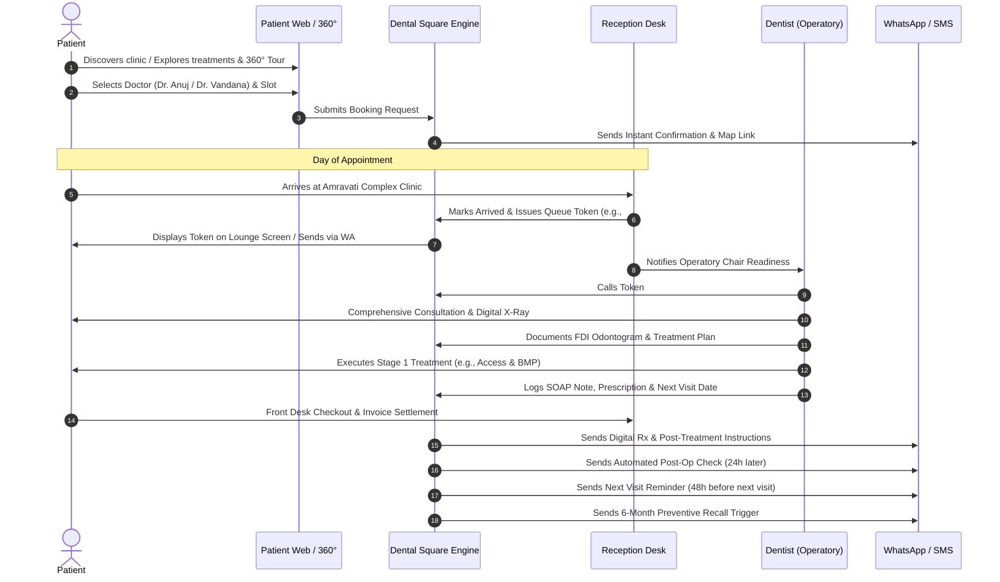
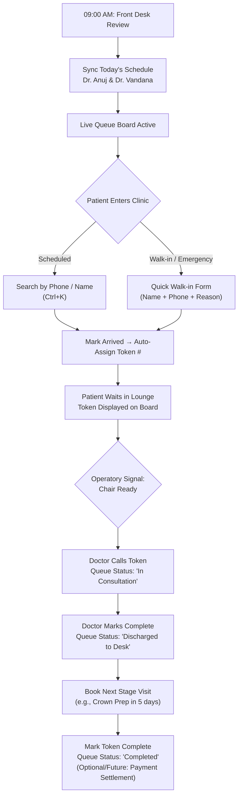
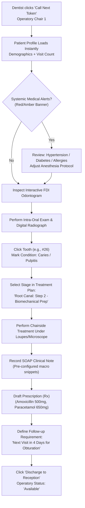
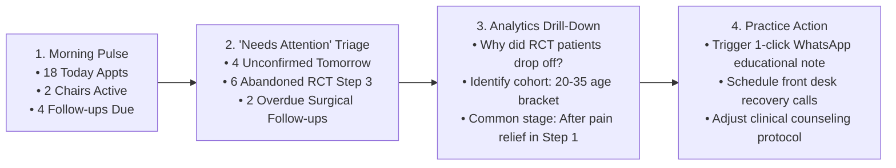

# 02. Dental Square — User Journeys & Clinical Workflows

---

## 1. Journey Architecture

Every clinical and operational interaction at Dental Square is mapped as a closed-loop journey. This ensures that no patient drops off unnoticed, no appointment is lost, and clinical documentation flows directly from chairside action into practice intelligence.

---

## 2. End-to-End User Journey Maps

### 2.1 The Complete Patient Journey

```
DISCOVER → EXPLORE → BOOK → CONFIRM → ARRIVE → QUEUE → CONSULT → TREAT → FOLLOW-UP → RECALL → RETURN
```



#### Detailed Step-by-Step Experience:
1. **Discovery & Exploration**:
   - Patient visits the responsive web platform on their mobile device or desktop.
   - Patient reviews clinic credentials, specialist expertise (Dr. Anuj Kumar for Maxillofacial/Implants, Dr. Vandana Choudhary for RCT/Cosmetics), and engages with the **360° Clinic Tour** to reduce clinical anxiety.
2. **Frictionless Booking**:
   - Patient selects: *New / Returning → Reason for Visit / Treatment Category → Preferred Doctor → Available Date & Time*.
   - Minimal input required: Full Name, Mobile Phone Number, and Optional Notes.
3. **Automated Confirmation**:
   - Instant booking confirmation sent via WhatsApp/SMS with Google Maps directions to Amravati Complex, Lalpur.
   - Calendar invite file (.ics) provided with a 1-tap reschedule/cancel option.
4. **Arrival & Queue Token**:
   - On arrival, patient approaches the front desk.
   - Reception marks the patient "Arrived", and the system assigns a sequential daily token (e.g., Token #07).
   - Patient sees current active token (#05 in Operatory 1, #06 in Operatory 2) on the waiting lounge display.
5. **Chairside Consultation & Treatment**:
   - Dentist calls token into Operatory 1.
   - Doctor examines the oral cavity, refers to chairside radiographs, and charts pathologies on the interactive Odontogram.
   - Doctor presents the step-by-step treatment plan to the patient on the chairside monitor.
6. **Discharge, Follow-Up & Recall**:
   - Reception settles billing and schedules the next visit.
   - Patient automatically receives post-care guidelines (e.g., "Do not consume hot beverages for 2 hours") on WhatsApp.
   - Automated triggers engage the patient for multi-visit continuity and 6-month preventive check-ups.

---

### 2.2 Reception & Front Desk Operational Workflow

```
MORNING SETUP → PATIENT ARRIVAL → TOKEN MANAGEMENT → CHAIR COORDINATION → BILLING & DISCHARGE → RECALL TRIAGE
```



---

### 2.3 Dentist Chairside Clinical Workflow

```
TOKEN CALL → MEDICAL ALERTS → ODONTOGRAM REVIEW → PROCEDURE EXECUTION → SOAP NOTES → PRESCRIPTION & NEXT VISIT
```



---

### 2.4 Clinic Owner & Practice Governance Workflow

```
PULSE REVIEW → NEEDS ATTENTION TRIAGE → COHORT DRILL-DOWN → OPERATIONAL INTERVENTION
```



---

## 3. Exception & Edge Case Workflows

### 3.1 Unscheduled Walk-In Handling (Core) & Emergency Triage (Future)
- **Core Demo Workflow**: Walk-in patients without an appointment are registered at the front desk using a simple quick form (Name + Phone + Primary Concern) and immediately issued a standard sequential queue token.
- **Future / Optional / Out of Scope Module**: A dedicated "Emergency Override Triage" action bar with real-time priority queue bumping and automatic operatory interruption alerts is classified as a future enhancement.
  1. Only 2 fields required: Patient Name + Phone Number.
  2. System flags token with an `URGENT / EMERGENCY` badge and inserts it at priority #1 above standard routine checkups.
  3. Attending dentist receives an instant visual alert in the operatory header.
  4. Emergency pulpectomy or stabilization is performed immediately.

### 3.2 Incomplete Multi-Visit Treatment Recovery (The "Pain-Free Drop-Off")
- **Scenario**: A patient undergoing Root Canal Treatment with Dr. Vandana Choudhary completes Step 1 (Access opening & pulp extirpation). Because their toothache is now gone, the patient fails to return for Step 2 (Canal obturation) or Step 3 (Permanent crown restoration).
- **Clinical Risk**: A temporary filling will degrade within 3–4 weeks, leading to re-infection, canal contamination, tooth fracture, or eventual loss of the tooth.
- **System Automated Intervention**:
  1. When a treatment step is marked `Obturation Complete - Pending Crown`, a 10-day retention timer starts.
  2. If no appointment is booked by Day 7, the patient appears in the owner's and front desk's **"Needs Attention: Incomplete Treatment Journeys"** list.
  3. One-click automated message is dispatched explaining the clinical danger: *"Dear [Name], your root canal treatment on tooth #26 is currently protected only by a temporary restoration. To prevent reinfection or tooth fracture, your permanent crown must be placed within 10 days. Click here to choose your slot: [Link]"*.

### 3.3 Patient No-Show & Same-Day Rescheduling
- **Scenario**: Patient does not arrive within 20 minutes of their scheduled appointment.
- **System Action**: Front desk marks the appointment `No-Show`.
- **Workflow**:
  1. The assigned chair time is immediately freed up for waiting walk-in patients.
  2. System sends a gentle WhatsApp message: *"We missed you today at Dental Square. Would you like to reschedule your consultation with Dr. Anuj Kumar? [Tap to Reschedule]"*.
  3. If patient reschedules, the appointment status updates to `Rescheduled` with the audit trail preserved.
