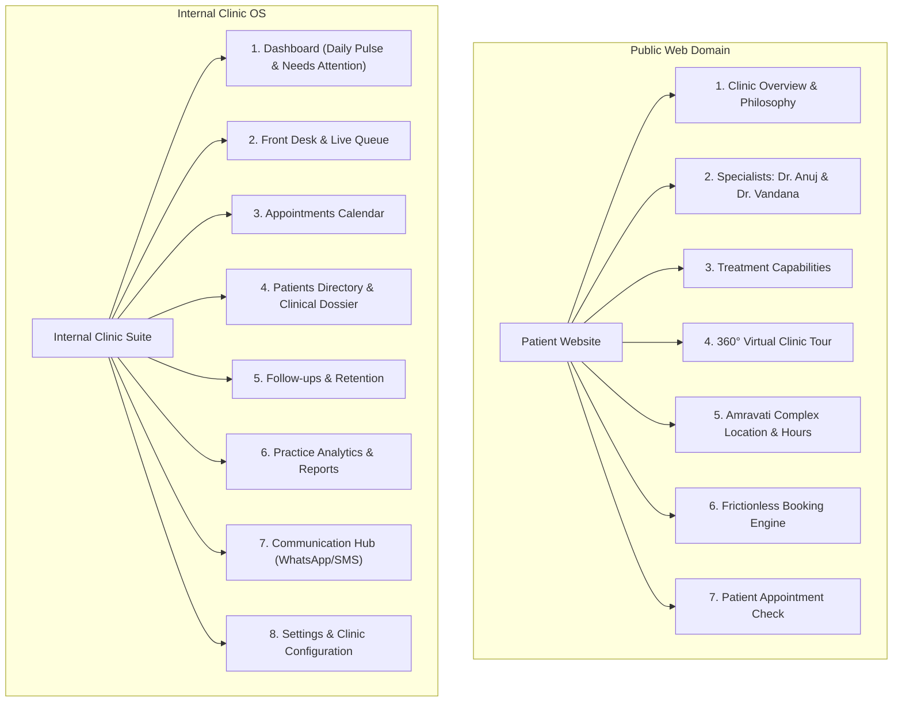

# 03. Dental Square — Information Architecture & Navigation Strategy

---

## 1. Architectural Evaluation & Navigation Rationalization

The initial proposed navigation contained 11 top-level items:
`Dashboard`, `Appointments`, `Patients`, `Queue & Front Desk`, `Clinical Records`, `Treatments`, `Follow-ups`, `Analytics`, `Communication`, `Reports`, `Settings`.

### 1.1 UX Evaluation & Optimization

Having 11 flat sidebar items introduces excessive cognitive load, breaks the 7±2 rule of human working memory, and blurs role responsibilities. Specifically:
- **`Reports` vs. `Analytics`**: In generic software, this is a redundant distinction. "Reports" (e.g., daily cash collection, procedure volume summaries, audit trails) represents the structured tabular export of "Analytics". Keeping them separate forces users to guess where to find data.
  - *Decision*: **Merge `Reports` directly into `Practice Analytics`** as a dedicated tab/export module.
- **`Clinical Records` vs. `Treatments` vs. `Patients`**: Having separate global lists for Clinical Records, Treatments, and Patients creates navigation fragmentation. In clinical reality, a doctor never edits a "Clinical Record" in isolation — they treat a *specific patient* who has an active *treatment plan* recorded on an *odontogram*.
  - *Decision*: Centralize clinical records and treatment plans inside the **Patient Clinical Dossier**, while providing a high-velocity **Chairside Operatory** shortcut for the active doctor.
- **`Queue & Front Desk` vs. `Appointments`**: The Front Desk needs a real-time live view of today's flow (`Live Queue & Desk`), while long-range scheduling needs a calendar (`Appointments Calendar`). These must remain distinct operational tools, but share tight bi-directional links.

---

## 2. Optimized Information Architecture

The system is split into two clear architectural spheres:
1. **The Public Patient Digital Identity** (Mobile-first patient experience).
2. **The Internal Clinic Operating System (Clinic OS)** (Role-aware desktop/tablet application).



---

## 3. Public Patient Web Experience Sitemap

The public web experience establishes trust, showcases clinical excellence, and leads directly to frictionless booking.

```
/ (Home)
├── #about-clinic           (Why Dental Square: Expertise, Technology, Sterilization)
├── #specialists            (Dr. Anuj Kumar - Maxillofacial; Dr. Vandana Choudhary - RCT/Cosmetics)
├── #treatments             (Interactive treatment explorer with transparent explanations)
│   ├── /treatments/rct     (Microscopic Root Canal Treatment)
│   ├── /treatments/implants(Dental Implants & Oral Surgery)
│   ├── /treatments/cosmetic(Smile Designing, Veneers & Bleaching)
│   ├── /treatments/ortho   (Aligners & Braces)
│   └── /treatments/general (Preventive Scaling, Fillings & Extractions)
├── #clinic-experience      (Real photography of lounge and modern operatories)
├── #360-virtual-tour       (Interactive 360° tour preview: "Step inside Dental Square")
├── #location-hours         (1st Floor Amravati Complex, Lalpur; Google Maps directions)
├── /book                   (Frictionless 4-step booking wizard)
└── /my-appointment         (Quick status check via OTP/Phone: View token & instructions)
```

---

## 4. Internal Clinic OS: Structural Navigation

The internal sidebar is streamlined to **8 clear, purpose-driven top-level modules**, organized by workflow frequency:

| # | Sidebar Navigation Item | Target Primary User | Core Purpose & Primary Screen View |
| :-: | :--- | :--- | :--- |
| **1** | **Dashboard** | All Roles (Personalized) | Daily operational pulse, active chair statuses, and the actionable **"Needs Attention"** triage engine. |
| **2** | **Front Desk & Queue** | Reception / Front Desk | Real-time token queue (#01, #02...), walk-in check-in, patient arrival marking, and waiting lounge monitor feed. |
| **3** | **Appointments** | Reception / Dentists | Interactive calendar (Day / Week / Multi-Doctor view) for long-range scheduling, drag-and-drop rescheduling, and chair assignment. |
| **4** | **Patients** | Dentists / Reception | Master patient directory, comprehensive search, and the deep **Patient Clinical Dossier** (Odontogram, SOAP notes, X-rays, Treatment Plans). |
| **5** | **Follow-ups & Recall**| Reception / Practice Admin| Daily post-op check calls, multi-visit continuity recovery (e.g., pending crowns), and 6-month preventive recall management. |
| **6** | **Practice Analytics** | Clinic Owner / Practice Admin| Practice intelligence, multi-dimensional drill-downs (RCT drop-offs, demographic distributions), and tabular report exports. |
| **7** | **Communication** | Reception / Practice Admin| WhatsApp/SMS notification templates, delivery logs, inbound replies, and patient consent management. |
| **8** | **Settings** | Clinic Owner / System Admin| Doctor schedules, operatory room definitions, procedure fee catalog, user permissions, and clinic profile. |

---

## 5. Screen Hierarchy & Page Architecture

### 5.1 Patient Clinical Dossier (Under `/patients/:id`)
A dentist or receptionist navigating to a specific patient sees a unified, tabbed clinical record designed around dental workflows:

```
Patient Clinical Dossier: [Patient Name] (UHID / Phone)
├── Header Bar: Name, Age, Gender, Phone, Last Visit Date, Critical Health Alert Banner (Red/Amber)
├── Tab 1: Overview & Journey (Linear timeline of all past visits, active treatment status)
├── Tab 2: Odontogram & Exam (Interactive 32-tooth chart, surface pathology, periodontal indices)
├── Tab 3: Treatment Plans (Active plans, completed stages, cost estimates, consent status)
├── Tab 4: Clinical Notes & SOAP (Timestamped doctor notes with procedure codes)
├── Tab 5: Radiographs & Media (Intraoral periapical X-rays, OPG scans, clinical photos)
├── Tab 6: Prescriptions (Rx history, print/export PDF, active medications)
└── Tab 7: Billing & Ledger [FUTURE / OPTIONAL / OUT OF CURRENT DEMO SCOPE]
```

### 5.2 Chairside Operatory View (High-Velocity Doctor Mode)
Accessible directly from the active token in the Queue or Dashboard:
- **Zero Administrative Clutter**: Automatically loads the current patient's active tooth chart and today's scheduled procedure.
- **Large Touch Targets**: Designed for tablet or touchscreen use next to the dental chair.
- **One-Tap Actions**: Mark step complete, add quick voice/text clinical snippet, generate standard Rx, and advance token.

---

## 6. Global Heuristics & Navigation Rules

1. **The 2-Click Rule**: Any clinical record, today's appointment, or active queue token must be reachable within a maximum of 2 clicks from anywhere in the system.
2. **Global Omnibox (`Ctrl + K` / `Cmd + K`)**: Instant keyboard-driven lookup across the entire clinic database:
   - Type phone number or name → Jump to Patient Dossier.
   - Type token number (e.g., `#07`) → Jump to Queue action.
   - Type procedure (e.g., `RCT`) → Jump to Treatment Analytics or Fee Catalog.
3. **Persistent Quick Action Bar**:
   - Always accessible at the top right of the application:
     - `+ Walk-in Patient` (Instant token issuance)
     - `+ New Appointment` (Quick booking modal)
     - *Emergency Override [FUTURE / OPTIONAL]*
4. **Contextual Breadcrumbs**: Every deep page (e.g., `Patients > Rajesh Sharma > Treatment Plan #402`) provides clickable breadcrumbs to prevent disorientation.
