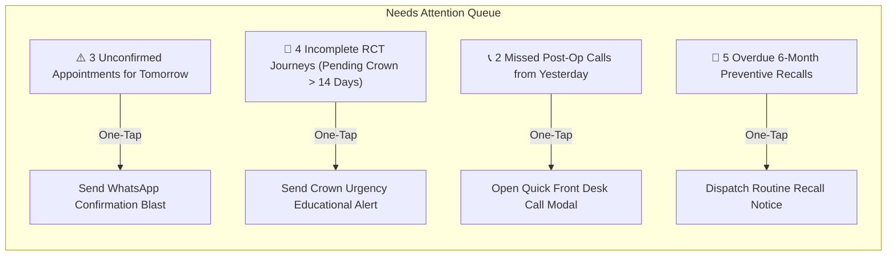

# 04. Dental Square — Dashboard Strategy & Operational Pulse

---

## 1. Core Dashboard Philosophy

```
The Main Dashboard is NOT the Analytics Page.
```

The primary dashboard exists to answer exactly two operational questions within 5 seconds:
1. **"How is my clinic doing right now, today?"**
2. **"Is there anything that requires my immediate attention or action?"**

It serves as the flight deck for the clinic's daily rhythm. Deep statistical trends, multi-year demographic distributions, and complex cohort analyses are intentionally banned from this screen and relegated to **Practice Analytics**.

```mermaid
flowchart TD
    subgraph Operational Dashboard ("What is happening today?")
        KPI["Top 5 Operational KPIs\n(Appointments, Waiting, In-Chair, Follow-ups, Collections)"]
        NA["🚨 'Needs Attention' Action Engine\n(Unconfirmed slots, drop-offs, overdue recalls)"]
        Sched["Today's Operatory Schedule\n(Operatory 1 & 2 Live Timeline)"]
        Mini["Concise Pulse Cards\n(Recent Arrivals, Procedure Breakdown, Sources)"]
    end
    
    subgraph Deep Intelligence ("Why did it happen?")
        PA["Practice Analytics Engine\n(Cohort drill-downs, demographic distributions, retention curves)"]
    end

    Mini -- "Click 'View Details →'" --> PA
    NA -- "Click 'Take Action →'" --> Workflow["Direct Action Workflow\n(Send WhatsApp batch, reschedule, call)"]
```

---

## 2. Top-Level Metric Deck (The Daily Pulse)

The dashboard presents five high-contrast, essential metric cards across the top:

| Metric Card | Target Question | Demo Data Point | Supporting Context / Subtext | Click / Drill-Down Action |
| :--- | :--- | :---: | :--- | :--- |
| **Today's Appointments** | Are we on schedule? | **18** | 12 Confirmed · 4 Completed · 2 Arrived | Opens Appointments Day View |
| **Waiting in Lounge** | Is the lobby congested? | **3** | Avg Wait Time: 11 mins · Longest: 18 mins | Opens Live Queue Board |
| **Active in Chair** | Are operatories active? | **2 / 2** | Op 1: Dr. Anuj (Implant) · Op 2: Dr. Vandana (RCT) | Opens Chairside Operatory View |
| **Follow-ups Due Today** | Are we keeping promises?| **6** | 4 Post-Op Checkups · 2 Crown Reminders | Opens Follow-up Action List |
| **Completed Treatments** | Are procedures finishing?| **8** | *(Demo data only — not real clinic stats)* | View Details → |

*Rule*: Metric cards must never display purely cosmetic icons or meaningless sparklines without comparative context. Financial/billing summaries are strictly demo data and out of current MVP scope.

---

## 3. The "Needs Attention" Action Engine

The most critical component of the dashboard is the **"Needs Attention"** triage module. Traditional software presents passive numbers; Dental Square turns metrics directly into clinical and operational workflows.

```
Metric → Visual Alert → Drill-Down Cohort → One-Click Action
```

### 3.1 Priority Triage Items



### 3.2 Triage Card Schema & Actions

1. **Unconfirmed Appointments (Tomorrow)**
   - *Trigger*: Appointments scheduled for tomorrow that have not received patient confirmation.
   - *Impact*: Eliminates clinic idle time and late no-shows.
   - *Action*: `[Send WhatsApp Reminders (3)]` or `[Call List]`.
2. **Incomplete Treatment Journeys (Pending Crowns)**
   - *Trigger*: Patients who completed endodontic obturation (RCT) with Dr. Vandana Choudhary more than 14 days ago without scheduling their permanent crown restoration.
   - *Impact*: Prevents tooth fracture and clinical failure while recovering practice revenue.
   - *Action*: `[Review 4 Patients]` → opens cohort with pre-filled clinical warning message.
3. **Overdue Post-Surgical Follow-Ups**
   - *Trigger*: Patients who underwent surgical extractions or implant placement with Dr. Anuj Kumar 48 hours ago without a documented post-op status check.
   - *Impact*: Ensures patient safety, manages postoperative pain, and builds trust.
   - *Action*: `[Log Post-Op Check]` with quick symptom checkboxes (*No pain / Mild pain / Swelling / Bleeding*).

---

## 4. Today's Operatory Schedule & Live Chair Status

A visual timeline of the day's clinic operations, split by physical operatory:

```
[09:00 AM ---------------- 01:00 PM]   [LUNCH]   [04:00 PM ---------------- 08:30 PM]
Operatory 1 (Dr. Anuj Kumar - Oral Surgery / Implants):
  [09:30 - 10:15: #38 Surgical Extraction (Completed)]
  [10:30 - 11:30: #46 Implant Placement (IN CHAIR - 42m elapsed)]
  [12:00 - 12:30: Consultation - Orthognathic (Scheduled)]

Operatory 2 (Dr. Vandana Choudhary - Endodontics / Restorative):
  [09:00 - 09:45: #16 Composite Restoration (Completed)]
  [10:00 - 11:00: #26 RCT Step 2 - BMP & Canal Shaping (IN CHAIR - 35m elapsed)]
  [11:15 - 12:00: #11 Cosmetic Veneer Prep (Arrived - In Lounge)]
```

### Operatory Controls:
- Clear visual badge: `🟢 Active (Elapsed Time)` | `🟡 Next Patient Waiting` | `⚪ Chair Sanitized & Ready`.
- One-click chair status toggle: `[Call Patient]` | `[Release Chair]`.

---

## 5. Summary Widgets (With Progressive Drill-Down)

Below the schedule, three compact, high-value summary cards provide contextual awareness without cluttering the screen. Every card includes a mandatory **"View Full Details →"** link pointing directly into Practice Analytics:

1. **Popular Procedures Today**:
   - Compact horizontal progress bars:
     - Root Canal Treatment (RCT): 5 cases (42%)
     - Preventive Scaling & Polishing: 3 cases (25%)
     - Surgical Extractions & Implants: 2 cases (17%)
     - Direct Composite Restorations: 2 cases (16%)
   - Link: `View Treatment Analytics →`
2. **Appointments by Source**:
   - Clean breakdown:
     - Google Search / 360° Tour: 8 patients (44%)
     - Returning Patients / Direct: 6 patients (33%)
     - Referral (Medica / Peer Doctor): 3 patients (17%)
     - Walk-in Footfall (Amravati Complex): 1 patient (6%)
   - Link: `View Acquisition Insights →`
3. **Recent Patients & Quick Activity**:
   - Most recent 4 clinic interactions with timestamp and procedure code.
   - Link: `View All Patients Directory →`

---

## 6. Anti-Overcrowding Rules for the Dashboard

To ensure the dashboard remains lightning-fast and calm:
- **Maximum 5 Top KPI Cards**: Never add a 6th card to the top row.
- **Zero Raw Tabular Data > 5 Rows**: Tables on the dashboard are capped at 5 preview items; deeper records live in their respective sub-views.
- **Zero Complex Multi-Line Regression Charts**: Trend analysis belongs exclusively in Analytics.
- **Zero Decorative Widgets**: Weather widgets, motivational quotes, or generic hospital bed trackers are banned.
- **Strict 2-Second Render Budget**: The entire dashboard must render instantaneously on both desktop and iPad.
