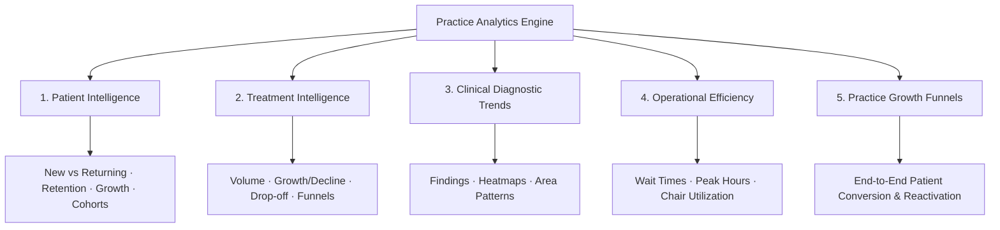
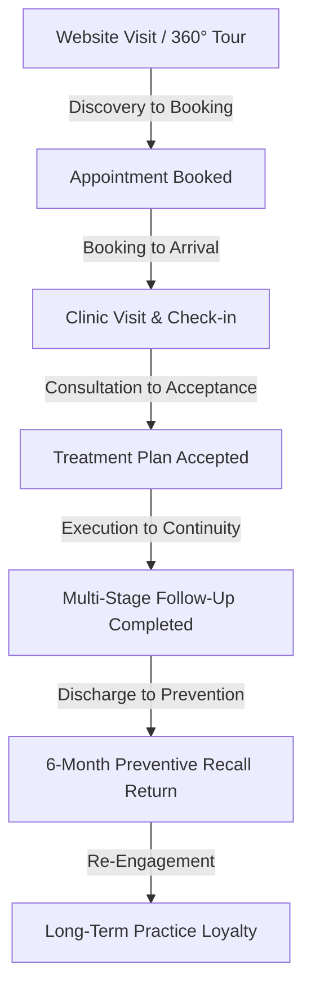
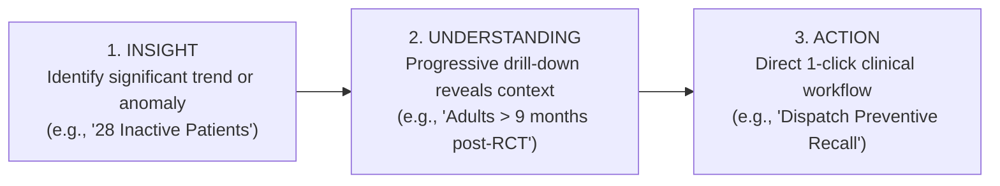

# 05. Dental Square — Practice Analytics & Clinical Intelligence

---

## 1. Core Analytics Philosophy

```
The Dashboard answers: "WHAT IS HAPPENING TODAY?"
Practice Analytics answers: "WHY, WHERE, WHEN, AND WHO?"
```

Practice Analytics provides deep, multi-dimensional diagnostic intelligence into clinical performance, patient retention, treatment completion funnels, operatory efficiency, and practice growth. It is strictly segregated from the operational dashboard so that daily clinic velocity is never bogged down by analytical computation or cognitive clutter.

---

## 2. Multi-Dimensional Analytical Hierarchy

Practice Intelligence is structured across five core dimensions:



---

## 3. Five Dimensions of Practice Intelligence

### 3.1 Dimension 1: Patient Intelligence
Answers: *Who are our patients, are they returning, and where are they from?*

- **New vs. Returning Patients**: Monthly and quarterly ratio tracking. Indicates whether the practice is sustaining long-term loyalty or solely relying on new footfall.
- **Patient Growth Over Time**: Net active patient base expansion tracking.
- **Retention Curve**: Cohort retention measured at 1, 3, 6, and 12 months post-initial visit.
- **Visit Frequency**: Average annual visits per patient segment (e.g., preventive 2x/year vs. one-off emergency).
- **Inactive Patients**: Patients with zero clinic interactions for > 9 months (target for reactivation).
- **Age Distribution**: Demographic segmentation across key dental life stages (0–14 Pediatric, 15–24 Adolescents/Young Adults, 25–44 Working Adults, 45–64 Mature Adults, 65+ Geriatric).
- **Gender Distribution**: Patient composition and treatment preferences by gender.
- **Geographic Distribution**: Catchment density across Ranchi (Lalpur, Circular Road, Morabadi, Kanke, Doranda, Hinoo, Outstation).
- **Acquisition Sources**: Attribution breakdown (Google Search / 360° Tour, Word-of-mouth, Hospital Referral from Medica, Amravati Complex walk-in footfall).

---

### 3.2 Dimension 2: Treatment Intelligence
Answers: *What procedures are being performed, which are growing, and where do patients abandon care?*

- **Most Requested Treatments**: Absolute procedure counts across the practice.
- **Treatment Trends (Growing vs. Declining)**:
  - *Growing Treatments*: Procedures experiencing month-over-month volume increases (e.g., Clear Aligners, Microscopic Endodontics).
  - *Declining Treatments*: Procedures dropping in volume, requiring clinical or marketing review.
- **Treatment Completion Rate**: Percentage of multi-stage treatment plans completed to final restoration.
- **Treatment Abandonment Points**: Stage-level drop-off analysis (e.g., patient drops off after pain subsides in RCT Step 1).
- **Pending Treatment Plans**: Total proposed treatments accepted vs. awaiting patient scheduling.
- **Treatment Conversion**: Rate of consultation recommendations converted into scheduled procedures.
- **Treatment-Wise Revenue Contribution**: Comparative financial performance per procedure category (*Demo data only in prototype — subject to future billing module*).

---

### 3.3 Dimension 3: Clinical Diagnostic Trends
Answers: *What oral pathologies are most prevalent, and which teeth are most affected?*

- **Common Clinical Findings**: Structured tracking of diagnoses charted on the Odontogram:
  - Dental Caries (Class I through V)
  - Pulpitis & Periapical Periodontitis
  - Gingivitis & Periodontal Pocket Depths
  - Non-Carious Cervical Lesions (Abrasion/Erosion)
  - Impacted Third Molars (#38, #48)
  - Fractured & Traumatized Teeth
- **Finding Trends Over Time**: Seasonal or longitudinal shifts in diagnosed conditions.
- **Tooth & Quadrant Heatmap**: Spatial visualization across FDI teeth 11–48, revealing high-stress zones (e.g., first permanent molars #16, #26, #36, #46).
- **Procedure-to-Finding Correlation**: Alignment between initial diagnostic complaints and final executed treatment.

---

### 3.4 Dimension 4: Operational Efficiency
Answers: *How smoothly is the clinic operating, and where are operational bottlenecks?*

- **Appointment Volume & Day-of-Week Load**: Identifying peak appointment days (e.g., Saturday surges).
- **Peak Clinic Hours**: Hourly appointment distribution across morning (09:30–13:00) and evening (16:30–20:30) sessions.
- **Patient Waiting Time**: Average and maximum duration spent in the reception lounge before chair call.
- **No-Show & Cancellation Rates**: Unfulfilled appointment slots categorized by notice period.
- **Rescheduling Frequency**: Patterns in moved appointments and high-friction timeslots.
- **Slot & Chair Utilization**: Percentage of available operatory chair time actively utilized by Dr. Anuj (Op 1) and Dr. Vandana (Op 2).

---

### 3.5 Dimension 5: Practice Growth & Patient Conversion Funnels
Answers: *How effectively does patient interest convert into long-term oral health?*



- **Website → Booking**: Conversion efficiency of public website visitors.
- **Booking → Visit**: Ratio of scheduled bookings that actually arrive at the front desk.
- **Consultation → Treatment**: Percentage of examined patients who initiate their treatment plan.
- **Treatment → Follow-up**: Adherence to postoperative and multi-stage continuity visits.
- **Follow-up → Return**: Long-term patient retention across subsequent treatment episodes.
- **Recall Conversion**: Success rate of 6-month preventive checkup invitations.
- **Patient Reactivation**: Number of previously inactive patients successfully re-engaged.

---

## 4. Actionable Analytics: "INSIGHT → UNDERSTANDING → ACTION"

```
Rule: Analytics must NEVER exist merely as passive, decorative charts.
Every analytical insight must connect directly to a clinical or operational action.
```



### 4.1 Concrete Workflow Walkthroughs

| Triggered Insight | Understanding (Drill-Down Context) | Direct Action Trigger |
| :--- | :--- | :--- |
| **"28 Inactive Patients"** | Patients who completed treatment > 9 months ago with zero recent checkups. | `[View 28 Patients]` → Select cohort → `[Send Personalized Checkup Invitation]` |
| **"7 Overdue Follow-ups"** | Patients who had surgical extractions or crown preps 5 days ago without documented review. | `[View Overdue List]` → `[Trigger Front Desk Call / WhatsApp Reminder]` |
| **"5 Unconfirmed Slots"** | Tomorrow's appointments with no confirmation response. | `[View Appointments]` → `[Send 1-Click WhatsApp Confirmation Blast]` |
| **"RCT Drop-Off Detected"** | 14 patients completed obturation but have not scheduled permanent crowns (> 14 days). | `[View Affected Cohort]` → `[Send Crown Urgency & Fracture Risk Advisory]` |

---

## 5. The Progressive Drill-Down Architecture

The analytics module enables intuitive multi-level exploration from high-level summaries down to individual patient care:

```
Level 1: Macro Dimension Overview
   ↓ (Select: Treatment Intelligence → Root Canal Treatment)
Level 2: Specific Procedure Funnel
   ↓ (Observe: 23% drop-off at Stage 3 Obturation)
Level 3: Filtered Demographic Breakdown
   ↓ (Filter: Age 25–38 · Treated by Dr. Vandana Choudhary)
Level 4: Identifiable Patient Cohort List
   ↓ (Displays 14 specific patient names, phone numbers, and elapsed days)
Level 5: Clinical Action Execution
   ↓ (Click: "[Send Crown Protection Advisory]" or "[Export Call List for Reception]")
```

---

## 6. Data Integrity & Visualization Standards

1. **Clean Visual Hierarchy**: Standardized line charts for trends, horizontal bars for categorical rankings, and step-down funnels for conversions.
2. **Palette Compliance**: Charts utilize the established design tokens (Navy `#0F2C59`, Teal `#0D5C58`, Operatory Blue `#4A6FA5`, Amber `#D97706`, Crimson `#DC2626`).
3. **Strict Separation of Real vs. Demo Data**: All prototype analytical volumes, charts, and financial summaries are driven by synthetic data generators with explicit `isDemo: true` labels, ensuring no confusion with actual clinic figures.
