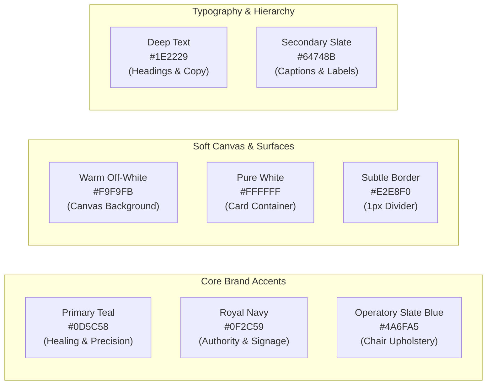

# 06. Dental Square — Visual Design Direction & Design Tokens

---

## 1. Brand Essence & Visual Philosophy

```
SOFT · MINIMAL · DENTAL · PREMIUM · CALM · TRUSTWORTHY · HUMAN · MODERN · EASY
```

Digital Dental Square translates the real, physical environment of Dental Square at Amravati Complex, Lalpur, Ranchi into a refined digital experience:
- **Warm Reception**: Teak wood, soft cove lighting, frosted glass partitions.
- **Clean Operatories**: Sterile white cabinetry, modern equipment, surgical microscope, and calm slate/periwinkle blue dental chairs.
- **Brand Authority**: Deep royal navy and clinical forest teal derived from the clinic's physical facade signage.

The interface communicates:
*"This is a professional dental clinic that genuinely cares about the patient experience."*
It does **NOT** communicate: *"This is a complicated medical ERP."*

```
Core Principle: "Complexity should exist underneath the interface, not inside it."
```

---

## 2. Design Tokens: Color System

The colors feel **soft**, calm, and professional. The primary accent is used strategically for primary CTAs, active navigation, selected states, and key data points. Most of the interface remains softly neutral.



### 2.1 Complete Core Token Palette

| Token Name | Hex Value | CSS Custom Property | Usage / Application |
| :--- | :--- | :--- | :--- |
| **`brand-teal`** | `#0D5C58` | `--ds-brand-teal` | Primary CTA buttons, active navigation, key data accents, focus rings |
| **`brand-navy`** | `#0F2C59` | `--ds-brand-navy` | Logo mark, primary headings, high-authority brand accents |
| **`operatory-blue`**| `#4A6FA5` | `--ds-operatory-blue` | Active dental chair status, clinical appointment markers, calm highlights |
| **`teal-soft`** | `#E6F4F1` | `--ds-teal-soft` | Selected state backgrounds, soft status pill backgrounds |
| **`surface-canvas`**| `#F9F9FB` | `--ds-surface-canvas` | Warm off-white page background (reduces clinical eye strain) |
| **`surface-card`** | `#FFFFFF` | `--ds-surface-card` | Container cards, modal surfaces, table rows, dropdown panels |
| **`border-subtle`** | `#E2E8F0` | `--ds-border-subtle` | Crisp 1px borders for cards, inputs, and section dividers |
| **`text-primary`** | `#1E2229` | `--ds-text-primary` | Deep charcoal for primary headings, table values, body text |
| **`text-secondary`**| `#64748B` | `--ds-text-secondary`| Muted slate for metadata, helper text, and secondary labels |
| **`text-muted`** | `#94A3B8` | `--ds-text-muted` | Disabled text, inactive icons, input placeholders |

### 2.2 Semantic Feedback Palette (Soft Tones)

Status colors are soft, accessible, and never neon or oversaturated. They always pair text with an icon to ensure color-independent readability:

| Semantic Role | Primary Hex | Soft Background Tint | Meaning / Context |
| :--- | :---: | :---: | :--- |
| **Success / Done** | `#0D7A68` (Soft Green) | `#E6F5F2` | Completed procedure, sound tooth, confirmed appointment, paid receipt |
| **Warning / Pending** | `#D97706` (Soft Amber) | `#FEF3C7` | Follow-up due today, pending crown restoration, unconfirmed tomorrow slot |
| **Attention / Notice**| `#EA580C` (Soft Orange)| `#FFEDD5` | Inactive patient cohort, missing radiograph, approaching recall |
| **Error / Urgent** | `#DC2626` (Soft Red) | `#FEE2E2` | Active caries, severe pain, systemic allergy alert, validation error |
| **Information** | `#2563EB` (Soft Blue) | `#EFF6FF` | In-chair active treatment, scheduled routine checkup, general note |

---

## 3. Typography System

The interface uses **ONE primary font system** for the entire product to maintain absolute visual harmony:
- **Primary Typeface**: **Plus Jakarta Sans** (with fallback to **Inter**).
  - Modern, open geometric apertures, calm human warmth, exceptional legibility at small sizes.
- **Monospace Accent**: **JetBrains Mono** / **Roboto Mono**.
  - Used strictly for Token numbers (`Token #07`), Tooth notation (`#26`), and UHID codes (`DS-1042`).

### 3.1 Typographic Scale & Hierarchy

```
Display (36px/700) → Page Title (24px/600) → Section Heading (18px/600) 
  → Card Heading (16px/600) → Body (14px/400) → Secondary (13px/400) 
  → Metadata/Labels (11px/600 uppercase)
```

| Hierarchy Level | Font Size | Weight | Line Height | Tracking | Application Context |
| :--- | :---: | :---: | :---: | :---: | :--- |
| **Display** | 36px (2.25rem) | 700 (Bold) | 44px | -0.02em | Hero headline on patient website |
| **Page Title** | 24px (1.5rem) | 600 (SemiBold)| 32px | -0.01em | Top page titles (e.g., "Front Desk & Queue") |
| **Section Heading**| 18px (1.125rem)| 600 (SemiBold)| 24px | -0.01em | Module headers, timeline headings |
| **Card Heading** | 16px (1.0rem) | 600 (SemiBold)| 22px | 0.00em | Card titles, modal headers, list headers |
| **Body** | 14px (0.875rem)| 400 (Regular) | 20px | 0.00em | Default body copy, form inputs, table rows |
| **Secondary Text** | 13px (0.8125rem)| 400 (Regular) | 18px | +0.01em | Supporting descriptions, timestamps, help text |
| **Metadata / Label**| 11px (0.6875rem)| 600 (SemiBold)| 14px | +0.02em | Status badges, category pills, input labels |
| **Monospace ID** | 16px / 20px | 700 (Bold) | 20px | Monospace | Token numbers (`#07`), Tooth IDs (`#46`) |

---

## 4. Spacing System (8-Point Scale)

Consistent whitespace is a major driver of the premium aesthetic. Arbitrary margin or padding values are strictly prohibited:

```
4px · 8px · 12px · 16px · 24px · 32px · 40px · 48px · 64px
```

- `4px` (`--ds-space-1`): Micro gap between icon and text.
- `8px` (`--ds-space-2`): Internal padding within compact badges and tags.
- `12px` (`--ds-space-3`): Gap between compact form elements and card rows.
- `16px` (`--ds-space-4`): Standard internal padding for cards, inputs, and modals.
- `24px` (`--ds-space-6`): Layout grid gap between dashboard cards and operatory columns.
- `32px` (`--ds-space-8`): Major section vertical margin.
- `40px` (`--ds-space-10`): Large section padding and drawer headers.
- `48px` (`--ds-space-12`): Tablet touch target minimum; hero content spacing.
- `64px` (`--ds-space-16`): Major page breaks and desktop hero section padding.

---

## 5. Border Radius & Subtle Elevation

### 5.1 Restrained Rounded Corners
- **Cards & Modals**: `12px` (`--ds-radius-lg`) — comfortably rounded, calm, modern.
- **Buttons & Form Inputs**: `8px` (`--ds-radius-md`) — comfortable tactile corners.
- **Status Badges, Filter Chips & Compact Pills**: `9999px` (`--ds-radius-pill`) — reserved strictly for tags and filters.
- *Anti-Pill Rule*: Avoid the "everything is a giant pill" aesthetic. Main containers and buttons must remain clean rounded rectangles.

### 5.2 Shadows & Surface Contrast
Shadows are extremely subtle. The design relies on **crisp 1px borders (`#E2E8F0`)**, surface contrast (`#FFFFFF` on `#F9F9FB`), and whitespace:
- **Default Card**: `border: 1px solid #E2E8F0; box-shadow: none;`
- **Subtle Hover / Active**: `border-color: #CBD5E1; box-shadow: 0 4px 12px rgba(15, 44, 89, 0.04);`
- **Floating Overlay / Modal**: `border: 1px solid #E2E8F0; box-shadow: 0 12px 28px -6px rgba(15, 44, 89, 0.08);`

---

## 6. Iconography & Dental Visual Language

### 6.1 Icon Family Principles
- One coherent icon family (e.g., Lucide Icons / Heroicons Outline) with consistent **1.5px / 2.0px stroke weight**.
- Clean, recognizable, non-decorative line-art.

### 6.2 Functional Dental Visual Language (Zero Cartoon Clipart)
- **Functional, Not Decorative**: Every visual element serves a clear clinical purpose.
- **Allowed Dental Visuals**:
  - Interactive anatomical tooth charts (FDI 11–48).
  - 5-facet tooth surface polygons (**O**cclusal, **M**esial, **D**istal, **B**uccal, **L**ingual).
  - Multi-stage Treatment Journey Timelines.
  - Dental procedure badges (*RCT, Scaling, Crown, Implant*).
  - Operatory chair status indicators.
- **Strictly Prohibited**:
  - ❌ Cartoon smiling teeth with faces, arms, or toothbrushes.
  - ❌ Childish dental mascots or cheesy puns.
  - ❌ Random decorative tooth graphics scattered across backgrounds.
  - ❌ Cliché red medical cross symbols everywhere.

---

## 7. Motion & Micro-Interactions

Motion must be **subtle, smooth, and purposeful**:
- **Duration**: Fast transitions: `150ms` (hover, button press); medium transitions: `250ms` (dropdowns, drawers, modal entry).
- **Easing**: Smooth natural curve (`cubic-bezier(0.16, 1, 0.3, 1)`).
- **Allowed Motion**: Modal/drawer slide-ins, queue token sequence updates, accordion expansions, subtle tab switching.
- **Prohibited Motion**: Constant floating objects, aggressive parallax, spinning 3D teeth, or slow entrance animations that hinder user speed.

---

## 8. Content & Microcopy Rules

Language must feel **warm, clear, professional, and human**:

| System Robotic Phrase (AVOID) | Human & Warm Phrase (USE) |
| :--- | :--- |
| "Appointment record successfully created." | **"Appointment confirmed."** |
| "Patient entity not found." | **"We couldn't find this patient."** |
| "Submit" | **"Confirm Appointment" / "Save Treatment Plan"** |
| "No data available." | **"No appointments scheduled yet."** |
| "Error 500: Database failure." | **"We couldn't load your schedule. [Try Again]"** |

---

## 9. Real Clinic Photography & 360° Experience

- **Real Photography Only**: Highlight authentic views of the Amravati Complex clinic, teak reception desk, sterilizers, and blue dental chairs.
- **"Explore Dental Square" 360° Component**:
  - Copy: *"Take a look around the clinic before your visit."*
  - CTA: `[Explore the Clinic →]` or `[Take the 360° Tour →]`
  - Built as an elegant interactive wrapper that will connect to authorized virtual tour assets in production. Current materials serve as design references.
