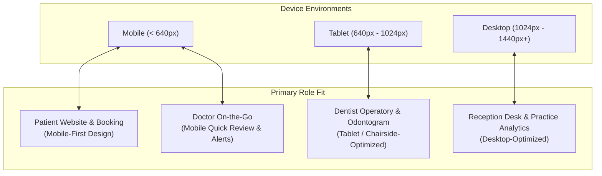

# 08. Dental Square — Responsive & Multi-Device Strategy

---

## 1. Multi-Device Philosophy

Digital Dental Square is not a desktop application hastily shrunk down to fit a mobile screen, nor is it a simplistic mobile app blown up on a large desktop monitor. 

The system implements a **Role-Device Optimization Model**:



---

## 2. Breakpoint Grid & Fluid Layout Tokens

The system adheres to four strict responsive breakpoints:

| Breakpoint Name | Viewport Width Range | Target Devices | Primary Layout Behavior |
| :--- | :---: | :--- | :--- |
| **Mobile (`sm`)** | `< 640px` | iPhone, Android smartphones | Single-column fluid stack; sticky bottom action bar; drawer modals. |
| **Tablet (`md`)** | `640px – 1023px` | iPad (10.2", Pro 11"), Galaxy Tab | Two-column responsive grid; collapsible left rail; touch odontogram. |
| **Desktop (`lg`)** | `1024px – 1439px`| Laptops, Operatory Monitors | Multi-column grid; persistent sidebar; split master-detail views. |
| **Wide Display (`xl`)**| `≥ 1440px` | Reception All-in-One PCs, 27" iMacs | Expanded dashboard; simultaneous queue, calendar, and analytics panels. |

---

## 3. Form-Factor Adaptive Behaviors

### 3.1 The Public Patient Experience (Mobile-First)
Over 80% of prospective dental patients in India browse clinics and book appointments via smartphones.

- **Thumb-Zone Optimization**: The primary booking button (`[Book an Appointment]`) and date selector are permanently pinned to the bottom thumb-reach zone.
- **Touch Target Dimensions**: Minimum touch footprint of **44x44px to 48x48px** on all clickable buttons, time slots, and navigation icons.
- **Mobile Keyboard Ergonomics**:
  - Phone inputs use `type="tel"` and `inputmode="tel"` to trigger the numeric keypad immediately.
  - Form fields prevent iOS/Android auto-zoom by maintaining a minimum 16px font size on inputs.
  - Focused fields smoothly auto-scroll into view above the virtual keyboard.
- **Frictionless Step-by-Step Flow**: Instead of a long, intimidating form, the booking flow presents a single question per screen on mobile:
  - *Screen 1*: Choose Concern / Doctor
  - *Screen 2*: Pick Date & Time Slot
  - *Screen 3*: Mobile Number & Name
  - *Screen 4*: Reassuring Instant Confirmation Card
- **360° Virtual Tour on Mobile**: Automatically enables touch/drag panning with smooth inertia, accompanied by an explicit full-screen toggle.
- **Zero Pinch-to-Zoom & Zero Horizontal Scroll**: Clean, single-column fluid reflow.

---

### 3.2 The Dentist Chairside Experience (Tablet / Touchscreen Optimized)
Dentists frequently operate with a tablet on an articulated arm beside the dental chair.

- **Touch Odontogram Adaptations**:
  - Tooth targets expand dynamically to a minimum touch footprint of **48x48px**.
  - Tapping a tooth opens a radial or popover menu around the tooth showing condition options (*Caries, Filled, RCT, Crown, Missing*), avoiding tiny checkbox dialogs.
  - Support for Apple Pencil / Stylus input for fast intraoral anatomical sketches or handwritten notes.
- **Voice-to-Text Clinical Dictation**: One-tap microphone trigger within the SOAP note block to dictate observations while hands remain in gloves.

---

### 3.3 The Reception Desk Board (Desktop-First)
Front desk executives require high information density and keyboard velocity.

- **Multi-Panel Split View**:
  - *Left Panel (35%)*: Real-time Arrival & Waiting Lounge Queue.
  - *Center Panel (45%)*: Today's Operatory Schedule (Dr. Anuj & Dr. Vandana).
  - *Right Panel (20%)*: Quick Patient Dossier preview and checkout billing actions.
- **Persistent Global Search (`Ctrl+K`)**: Rapidly locate records without leaving the active screen.

---

### 3.4 The Doctor Mobile Companion (Responsive Web App / PWA)
When doctors are off-site or at Medica Hospital:
- **Morning Briefing View**: A lightweight, secure mobile screen showing today's surgical and endodontic case list.
- **Emergency Notifications**: Instant push alerts if an acute trauma walk-in arrives at the Lalpur clinic.

---

## 4. Responsive Transformation Rules

To prevent broken or unreadable interfaces on smaller viewports:

### Rule 1: No Horizontal Table Scrolling on Mobile
Wide data tables (e.g., Patient Directory with 8 columns) transform into structured **Patient Cards** on mobile devices:

```
Desktop View (Wide Table):
[ Name ]   [ UHID ]   [ Phone ]   [ Last Visit ]   [ Procedure ]   [ Balance ]   [ Action ]

Transforms on Mobile (< 640px) into Structured Card:
+-------------------------------------------------------+
| Rajesh Sharma  (#DS-1042)             [ Today, 10:30 ]|
| +91 94311 XXXXX  ·  Male, 34 yrs                      |
| Procedure: #26 RCT Stage 2 (Dr. Vandana)              |
| Balance Due: ₹2,000                       [ View → ]  |
+-------------------------------------------------------+
```

### Rule 2: Responsive Sidebar Navigation
- **Desktop (`≥ 1024px`)**: Fixed 260px left sidebar with icons, clear labels, and clinic profile.
- **Tablet (`640px – 1023px`)**: Icon-only collapsed rail (68px) with hover/touch tooltips, expanding on click.
- **Mobile (`< 640px`)**: Smooth slide-over sheet triggered by a top-left hamburger menu, plus a persistent 4-item bottom bar for frequent actions (*Home, Queue, Calendar, Search*).

### Rule 3: Analytics Chart Reflow
- Multi-column chart grids collapse into a single vertical scroll stream on mobile.
- Donut charts adjust legend placement from the right side (desktop) to the bottom (mobile) to preserve chart radius.
- Complex multi-stage funnels (e.g., RCT completion funnel) switch from horizontal flowchart to vertical step-down cards.

### Rule 4: Zero Desktop-Only Critical Actions
Every critical clinic operation (checking in a patient, booking an appointment, advancing a queue token, logging a note) can be performed on any device form factor. No feature is hidden behind an arbitrary "desktop-only" wall.
