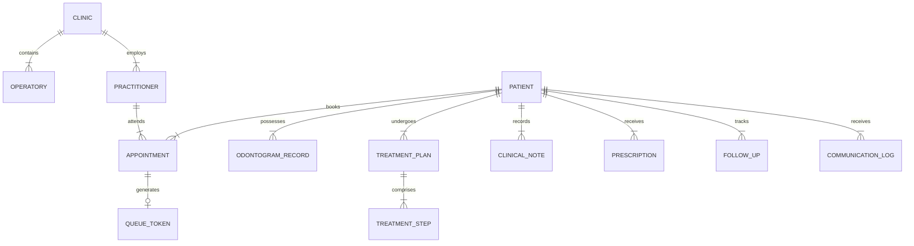

# 09. Dental Square — Data Requirements, Privacy & Security Architecture

---

## 1. Domain Data Model Overview

Digital Dental Square's data architecture is specifically modeled around dental anatomy, multi-visit clinical journeys, and real-time operatory coordination. Generic CRM abstractions (deals, leads, pipelines) are strictly excluded in favor of clinical healthcare entities.



---

## 2. Core Entity Schemas & Fields

### 2.1 Practitioner Entity
Represents the licensed clinicians operating at Dental Square:
```typescript
interface Practitioner {
  id: string; // e.g., "doc_anuj_kumar" | "doc_vandana_choudhary"
  fullName: string; // "Dr. Anuj Kumar"
  qualifications: string; // "BDS, MDS"
  specialization: string; // "Oral & Maxillofacial Surgeon"
  affiliations?: string; // "Consultant - Medica Hospital"
  assignedOperatoryId: string; // "operatory_1"
  scheduleDays: string[]; // ["Monday", "Tuesday", ...]
  workingHours: { start: string; end: string }; // "09:30" to "20:30"
  isActive: boolean;
}
```

### 2.2 Patient Entity
```typescript
interface Patient {
  id: string; // Unique ID (e.g., "DS-2026-1042")
  fullName: string;
  phone: string; // e.g., "+91 94311 XXXXX"
  email?: string;
  gender: 'MALE' | 'FEMALE' | 'OTHER';
  age: number;
  dateOfBirth?: string;
  address?: {
    street: string;
    area: string; // e.g., "Lalpur", "Morabadi", "Doranda"
    city: string; // "Ranchi"
    state: string; // "Jharkhand"
    pincode: string; // "834001"
  };
  emergencyContact?: {
    name: string;
    relation: string;
    phone: string;
  };
  // Critical Clinical Safety Alerts
  systemicAlerts: {
    hasDiabetes: boolean;
    hasHypertension: boolean;
    isPregnant: boolean;
    hasCardiacCondition: boolean;
    hasBleedingDisorder: boolean;
    drugAllergies: string[]; // e.g., ["Penicillin", "Sulfa drugs"]
    otherConditions?: string;
  };
  firstVisitDate: string; // ISO Timestamp
  lastVisitDate: string;
  totalVisits: number;
  status: 'ACTIVE' | 'INACTIVE' | 'ARCHIVED';
  isDemo: boolean; // Flags synthetic demo records
}
```

### 2.3 Appointment & Queue Token Entities
```typescript
interface Appointment {
  id: string;
  patientId: string;
  practitionerId: string;
  operatoryId: string;
  scheduledStartTime: string; // ISO 8601
  scheduledEndTime: string;
  reasonForVisit: string; // "Severe lower molar pain"
  treatmentCategory: 'CONSULTATION' | 'RCT' | 'SURGERY' | 'IMPLANT' | 'COSMETIC' | 'GENERAL';
  status: 'SCHEDULED' | 'CONFIRMED' | 'ARRIVED' | 'IN_CHAIR' | 'COMPLETED' | 'CANCELLED' | 'NO_SHOW';
  source: 'PATIENT_WEB' | 'PHONE_RECEPTION' | 'WALK_IN' | 'DOCTOR_REFERRAL';
  confirmationStatus: 'PENDING' | 'CONFIRMED_BY_PATIENT' | 'FAILED';
  createdAt: string;
  updatedAt: string;
}

interface QueueToken {
  id: string;
  dailySequence: number; // e.g., 7 for "Token #07"
  date: string; // "2026-09-18"
  appointmentId?: string; // Optional if unscheduled walk-in
  patientId: string;
  priority: 'NORMAL' | 'URGENT_EMERGENCY';
  status: 'WAITING' | 'CALLED' | 'IN_CHAIR' | 'DISCHARGED' | 'CANCELLED';
  arrivalTime: string;
  calledTime?: string;
  completedTime?: string;
  waitDurationMinutes?: number;
  assignedOperatoryId: string;
}
```

### 2.4 Dental Odontogram & Clinical Entities
```typescript
interface OdontogramToothRecord {
  id: string;
  patientId: string;
  toothNumber: number; // FDI Two-Digit (11-48 adult, 51-85 child)
  surfaces: {
    occlusal?: 'SOUND' | 'CARIES' | 'AMALGAM' | 'COMPOSITE' | 'GIC';
    mesial?: 'SOUND' | 'CARIES' | 'COMPOSITE' | 'RESTORATION';
    distal?: 'SOUND' | 'CARIES' | 'COMPOSITE' | 'RESTORATION';
    buccal?: 'SOUND' | 'CARIES' | 'CERVICAL_ABRASION' | 'COMPOSITE';
    lingual?: 'SOUND' | 'CARIES' | 'COMPOSITE';
  };
  overallStatus: 'SOUND' | 'CARIES' | 'RCT_IN_PROGRESS' | 'RCT_COMPLETED' | 'CROWN_PFM' | 'CROWN_ZIRCONIA' | 'MISSING' | 'IMPLANT';
  mobilityGrade?: 0 | 1 | 2 | 3;
  periodontalPocketDepthMm?: number;
  clinicalNotes?: string;
  lastUpdated: string;
}

interface TreatmentPlan {
  id: string;
  patientId: string;
  practitionerId: string;
  title: string; // e.g., "Full Endodontic & Restorative Rehabilitation #26"
  status: 'PROPOSED' | 'ACCEPTED' | 'IN_PROGRESS' | 'COMPLETED' | 'ABANDONED';
  totalEstimatedCost: number;
  steps: TreatmentPlanStep[];
}

interface TreatmentPlanStep {
  stepNumber: number;
  procedureCode: string; // e.g., "D-RCT-01", "D-CRW-02"
  description: string; // "Biomechanical Preparation & Canal Shaping"
  toothNumbers: number[]; // [26]
  status: 'PENDING' | 'IN_PROGRESS' | 'COMPLETED';
  estimatedCost: number;
  completedAt?: string;
}
```

### 2.5 Clinical Notes (SOAP) & Prescriptions (Rx)
```typescript
interface ClinicalNote {
  id: string;
  patientId: string;
  practitionerId: string;
  appointmentId: string;
  subjective: string; // Patient complaint & history of present illness
  objective: string;   // Clinical exam, vitality tests, percussion, X-ray findings
  assessment: string;  // Diagnosis (e.g., "Irreversible Pulpitis #26")
  plan: string;        // Procedure executed today + next visit objectives
  createdAt: string;
  signedByPractitioner: boolean;
}

interface Prescription {
  id: string;
  patientId: string;
  practitionerId: string;
  appointmentId: string;
  medications: {
    drugName: string; // "Amoxicillin + Potassium Clavulanate"
    brandExample?: string; // "Augmentin 625mg"
    dosage: string; // "1 tablet"
    frequency: 'ONCE_DAILY' | 'TWICE_DAILY' | 'THRICE_DAILY' | 'FOUR_TIMES_DAILY' | 'SOS_AS_NEEDED';
    durationDays: number; // 5
    instructions: 'BEFORE_FOOD' | 'AFTER_FOOD' | 'WITH_MILK';
  }[];
  specialPrecautions?: string;
  createdAt: string;
}
```

---

## 3. Demo Data Architecture & Seeding Strategy

To ensure zero risk of exposing real patient information while developing and validating the system:

1. **Explicit Seed Isolation**:
   - All synthetic records are marked with `isDemo: true`.
   - Seed scripts generate 50–100 realistic patient profiles using culturally authentic names and local Ranchi addresses (e.g., *Morabadi, Lalpur, Kanke Road, Doranda, Bariatu*).
2. **Clinical Consistency in Demo Data**:
   - Multi-visit treatment histories are generated with clinically valid timelines (e.g., an RCT patient will have 3 visits spaced 3 to 7 days apart, matching Dr. Vandana's clinical workflow).
3. **One-Click Data Reset**:
   - In prototype mode, an administrative utility can reset demo data to the initial state without impacting system configurations.

---

## 4. Healthcare Privacy, Data Security & Compliance

Dental records contain sensitive clinical and personal data. Digital Dental Square enforces healthcare-grade security:

### 4.1 Data Protection Principles
- **No Public Exposure of Clinical Information**:
  - The patient appointment booking portal and status check expose **zero** clinical records, tooth charts, or diagnostic notes.
  - Appointment confirmations reveal only the date, time, doctor name, and clinic address.
- **Field-Level Encryption**:
  - Sensitive clinical notes, systemic medical alerts, and intraoral radiographs are encrypted at rest using AES-256.
- **Audit Logging**:
  - Every view, edit, or export of a patient record generates an immutable audit entry (`userId`, `timestamp`, `action`, `patientId`, `ipAddress`).
- **Destructive Action Protection**:
  - Deletion of patient records, clinical notes, or financial ledgers is restricted to Clinic Owners and requires two-factor confirmation.
- **Healthcare Privacy & Security Alignment**:
  - Healthcare privacy and security considerations aligned with applicable Indian requirements, subject to formal legal/compliance review before production deployment. The prototype demonstrates privacy-aware architecture rather than making formal legal or regulatory certification claims.

---

## 5. Prototype Clinical Notation & Demo Disclaimers

1. **FDI Notation Confirmation**:
   - **FDI Two-Digit Notation** is the prototype default and must be confirmed against Dental Square's actual clinical workflow before production deployment. The data schema supports an alternate mapping layer for Universal notation (1–32) if requested by the clinical team.
2. **Strict Demo Data Separation**:
   - All patient identities, treatment statistics, diagnostic findings, appointment volumes, and financial indicators in prototypes and walkthroughs are **purely synthetic demo data**.
   - These numbers do NOT represent, estimate, or imply Dental Square's real clinical activity, patient volume, or financial performance.
   - Real clinic references are strictly confined to authorized clinic identity: physical location at Amravati Complex, verified practitioner credentials (Dr. Anuj Kumar & Dr. Vandana Choudhary), and physical clinic aesthetics.
