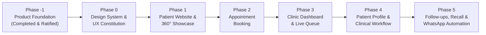

# 10. Dental Square — Implementation Roadmap & Execution Framework

---

## 1. Locked Phased Development Strategy (Phases 0 to 5 Only)

To prevent visual inconsistencies, scope creep, and architectural rework, Digital Dental Square adheres to a strict, sequential **6-phase implementation roadmap** (Phases 0 through 5).

```
================================================================================
CRITICAL ARCHITECTURAL BOUNDARY:
THE ROADMAP IS PERMANENTLY LOCKED TO PHASES 0 THROUGH 5.
THERE ARE NO PHASES AFTER PHASE 5 FOR THIS PROJECT PLAN.
Do not create Phase 6, Phase 7, Phase 8, "Hardening Phase", or "Future Phase".
Optional/future functionality is documented inside the relevant phase as 
OPTIONAL / FUTURE SCOPE, but must NOT become a new phase.
================================================================================
```



---

## 2. Detailed Phase Breakdowns & Acceptance Criteria

### Phase 0: Design System & UX Constitution
- **Core Objective**: Establish the visual, UX, responsive, and component foundation for the entire product before building actual screens.
- **Key Deliverables**:
  - Formal Design Token System (Colors `#0D5C58`, `#0F2C59`, `#4A6FA5`, `#F9F9FB`, `#FFFFFF`, `#1E2229`, `#64748B`, `#E2E8F0`; Typography scale; 8pt spacing system; radius tokens; subtle shadows).
  - Component library specifications (Buttons, Inputs, Modals, Badges, Odontogram, Queue Cards, Timelines).
  - Role-specific UX Constitutions (Patient, Reception, Dentist, Owner).
  - Responsive & Multi-device strategy (Mobile-first, Tablet-first, Desktop-first).
  - Standalone interactive **Design System Showcase** (`design-system/showcase.html`).
- **Definition of Done (DoD)**:
  - Design tokens, component rules, and UX constitutions fully codified.
  - Interactive showcase validates components, states, and responsive behavior with zero build errors.

---

### Phase 1: Patient Website & 360° Clinic Showcase
- **Core Objective**: Create the public-facing digital identity of Dental Square.
- **Key Deliverables**:
  - High-performance, mobile-first responsive homepage.
  - Dedicated sections: *Why Dental Square, Verified Specialists (Dr. Anuj Kumar & Dr. Vandana Choudhary), Treatment Capabilities, Location & Hours at Amravati Complex, Lalpur*.
  - **"Explore Dental Square" 360° Virtual Tour Showcase**: Conceptual tour viewer wrapper designed for authentic clinic viewpoints. *(Note: Production deployment will connect to authorized/approved 360° assets)*.
  - Verified patient review showcase (reflecting the 4.9★ rating without fake testimonials).
  - Clear, prominent primary CTA: `Book an Appointment`.
- **Definition of Done (DoD)**:
  - Mobile-first, responsive, zero horizontal scroll.
  - Lighthouse performance score > 90 on mobile devices.

---

### Phase 2: Appointment Booking Engine
- **Core Objective**: Deliver a streamlined 45-second booking experience for patients.
- **Key Deliverables**:
  - 4-step progressive wizard: *Concern/Doctor → Date/Time Slot → Basic Patient Info → Instant Confirmation*.
  - Clean availability display reflecting doctor morning/evening clinic sessions.
  - Reassuring confirmation screen with Google Maps link to Amravati Complex and calendar invite (.ics).
  - Integration with intake queue (`source: 'PATIENT_WEB'`).
- **Definition of Done (DoD)**:
  - Booking completes in under 45 seconds without mandatory password creation.
  - Appointments feed cleanly into the reception intake queue.

---

### Phase 3: Clinic Dashboard & Live Queue Management
- **Core Objective**: Equip the front desk and practice leadership with instant situational awareness.
- **Key Deliverables**:
  - Concise Operational Dashboard answering *"What is happening today?"* with Top 5 KPIs (Today's Appts, Waiting Lounge, Active in Chair, Follow-ups Due, Completed Treatments).
  - **Live Token Queue Board**: Sequential token generation (#01, #02...), arrival check-in, and chair handoff to Operatory 1 & 2.
  - Waiting lounge monitor display mode (fullscreen view for lounge TV).
  - **"Needs Attention" Action Engine**: Direct triage list with 1-click actions (*Send Reminders, Call List*).
  - Summary pulse widgets with `View Details →` links to practice analytics.
  - *(Optional / Future Scope: Complex multi-tier billing and discharge ledgers)*.
- **Definition of Done (DoD)**:
  - Front desk can check in an arriving patient and issue a token within 5 seconds.
  - Dashboard loads instantaneously and remains uncluttered.

---

### Phase 4: Patient Profile & Clinical / Treatment Workflow
- **Core Objective**: Empower Dr. Anuj Kumar and Dr. Vandana Choudhary with an intuitive chairside operatory interface.
- **Key Deliverables**:
  - Full Patient Clinical Dossier (Visit history, medical alert banner in red/amber, radiographs).
  - Interactive chairside 32-tooth **Dental Odontogram** (FDI Two-Digit prototype default, 5 selectable surfaces).
  - Multi-stage **Treatment Plan Journey** (e.g., tracking RCT from access to crown restoration).
  - Rapid chairside SOAP clinical note editor with pre-configured dental macros.
  - Structured digital prescription generator (Rx).
  - Integrated practice intelligence tracking (Clinical finding trends, treatment volume, and drop-off analysis).
- **Definition of Done (DoD)**:
  - Clinicians can document completed procedures, update tooth status, and generate Rx in < 60 seconds.
  - High-priority medical alerts display prominently before any clinical intervention.

---

### Phase 5: Follow-ups, Communication & WhatsApp Automation
- **Core Objective**: Complete the clinic retention loop with automated post-operative care, recall scheduling, and patient messaging.
- **Key Deliverables**:
  - Systematic follow-up management: Post-op surgical checks, treatment continuation reminders (e.g., reminding an RCT patient to get a crown after 14 days), and 6-month preventive recall triggers.
  - Practice Intelligence & Actionable Analytics Engine: Longitudinal 5-dimension insights (Patient, Treatment, Clinical, Operational, Growth) with progressive drill-downs and one-click cohort outreach (`INSIGHT → UNDERSTANDING → ACTION`).
  - WhatsApp & SMS Communication Layer: Consent-aware notification templates, delivery logs, and patient communication history.
  - End-to-end responsive polish, WCAG 2.1 Level AA accessibility validation, and comprehensive demo walkthrough.
- **Definition of Done (DoD)**:
  - Complete closed-loop workflow: Discovery → Booking → Queue → Chairside Care → Follow-up → Recall.
  - Zero critical accessibility or responsive flaws across mobile, tablet, and desktop.

---

## 3. Transition Gate Rules

To maintain high architectural discipline, the following transition gates are mandatory:
1. **No jumping phases**: Phase 1 cannot begin before Phase 0 primitives are validated. Phase 3 cannot begin before booking data schemas are stabilized in Phase 2.
2. **Zero scope expansion beyond Phase 5**: All product capabilities, polish, analytics, and automation are completed within the designated 6 phases (Phases 0 to 5).
3. **Zero code redesign**: Because all entity schemas, design tokens, and workflows are codified in Phase -1 and Phase 0, implementation proceeds with maximum velocity and zero ambiguity.
