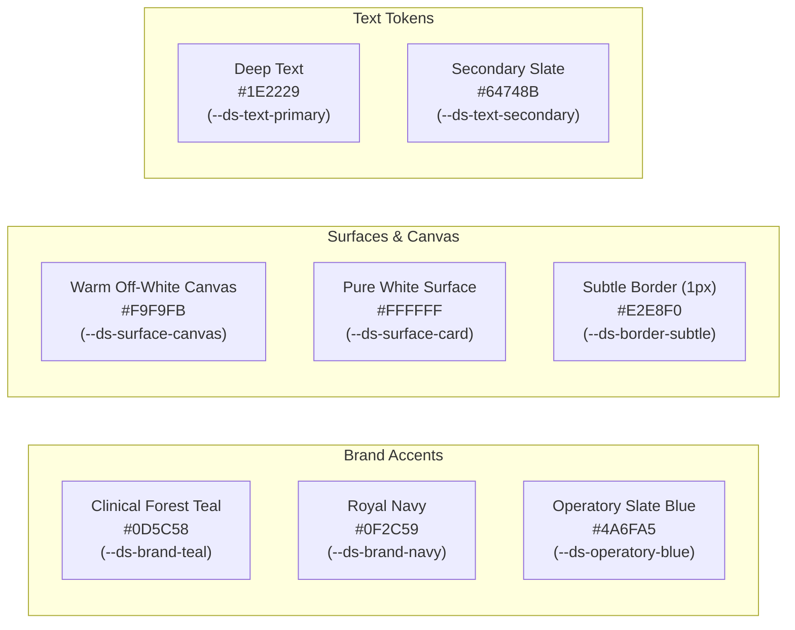

# Digital Dental Square — Phase 0: Design System & UX Constitution

```
================================================================================
PROJECT: DENTAL SQUARE
LOCATION: 1st Floor, Amravati Complex, Lalpur, Ranchi, Jharkhand 834001, India
SPECIALISTS: Dr. Anuj Kumar (BDS, MDS) & Dr. Vandana Choudhary (BDS, MDS)
PHASE: 0 (Design System & UX Constitution)
STATUS: Authoritative Master Specification
LOCKED ROADMAP: Phase 0 to Phase 5 Only (No phases after Phase 5)
================================================================================
```

---

## 1. Executive Summary & Design Mission

Phase 0 establishes the single source of visual, UX, interaction, and architectural truth for the entire **Digital Dental Square** product ecosystem.

```
"Design the system once so that every later screen feels like it belongs to the same product."
```

### 1.1 The Visual North Star
Digital Dental Square is the digital manifestation of the real, highly regarded dental clinic operating at Amravati Complex, Lalpur, Ranchi:
- **Atmospheric Translation**: Warm teak wood finishes, soft cove lighting, and frosted glass partitions of the reception lounge translated into calm, off-white surfaces (`#F9F9FB`), crisp white card containers (`#FFFFFF`), and deep charcoal text (`#1E2229`).
- **Clinical Operatory Translation**: High-tech ergonomic dental chairs upholstered in calm slate/periwinkle blue (`#4A6FA5`), overhead surgical microscope, and clean sterile cabinetry translated into precision clinical components, high-contrast tooth charts, and purposeful teal accents (`#0D5C58`).
- **Brand Authority**: Deep royal navy (`#0F2C59`) derived directly from the physical ACP facade signage on Circular Road.

### 1.2 The Nine Sensory Descriptors
```
MINIMAL · SOFT · DENTAL · PREMIUM · CALM · TRUSTWORTHY · HUMAN · MODERN · EASY
```

The system communicates:
*"This is a professional dental clinic that genuinely cares about the patient experience."*
It intentionally avoids feeling like:
- A generic hospital ERP or archaic HIMS
- A generic Silicon Valley SaaS CRM
- A dark cyberpunk or glowing neon dashboard
- A childish dental application with cartoon smiling teeth

---

## 2. Core Architectural & Interaction Principles

### 2.1 Principle 1: Complexity Underneath, Simplicity on the Surface
A dental practice manages intricate clinical workflows: multi-visit endodontics (pulpectomy → shaping → obturation → crown), drug allergy cross-checks, and chairside queue management. The interface hides data validation and state synchronization behind clean, linear, glanceable cards.

### 2.2 Principle 2: Progressive Disclosure
```
"Show what matters now. Reveal what matters next. Hide what does not matter yet."
```
- The main dashboard displays: `426 Patients · [ View Details → ]`.
- Clicking reveals: New vs. Returning ratio, cohort retention, and demographic distributions.
- We never dump multi-dimensional analytics walls onto operational flight decks.

### 2.3 Principle 3: Golden Rule of Premium Healthcare Design
```
"Premium comes from clarity, consistency, whitespace, and restraint — never from visual excess."
```
No excessive gradients, no glowing borders, no heavy drop shadows, no glassmorphism everywhere, and no cartoon clipart.

---

## 3. Formal Design Token System

### 3.1 Color Palette Tokens



#### Core Color Table:
| Token Name | Hex Value | CSS Variable | Application & Behavior |
| :--- | :--- | :--- | :--- |
| **`brand-teal`** | `#0D5C58` | `--ds-brand-teal` | Primary action CTAs, active nav items, key data highlights, keyboard focus rings |
| **`brand-navy`** | `#0F2C59` | `--ds-brand-navy` | Logo typography, high-authority headings, modal headers |
| **`operatory-blue`**| `#4A6FA5` | `--ds-operatory-blue`| Active chair indicators, clinical schedule blocks, calm highlights |
| **`teal-soft`** | `#E6F4F1` | `--ds-teal-soft` | Selected state backgrounds, soft badge backdrops |
| **`surface-canvas`**| `#F9F9FB` | `--ds-surface-canvas`| Full-viewport warm canvas (reduces glare and clinical anxiety) |
| **`surface-card`** | `#FFFFFF` | `--ds-surface-card` | Container cards, popovers, table surfaces, drawers |
| **`border-subtle`** | `#E2E8F0` | `--ds-border-subtle` | 1px border on cards, input containers, and structural dividers |
| **`text-primary`** | `#1E2229` | `--ds-text-primary` | Primary body copy, headings, numerical KPI figures |
| **`text-secondary`**| `#64748B` | `--ds-text-secondary`| Supporting metadata, timestamps, table column headers |
| **`text-muted`** | `#94A3B8` | `--ds-text-muted` | Input placeholders, disabled text, inactive step icons |

#### Soft Semantic Feedback Palette:
Status colors are soft, accessible, and never neon. Every status indicator must pair color with an icon and text:
- **Success / Done**: `#0D7A68` (Soft Green) · Background: `#E6F5F2` (Completed procedure, sound tooth, confirmed appointment)
- **Warning / Pending**: `#D97706` (Soft Amber) · Background: `#FEF3C7` (Follow-up due, crown pending > 14 days, unconfirmed slot)
- **Attention / Notice**: `#EA580C` (Soft Orange) · Background: `#FFEDD5` (Inactive cohort, approaching 6-month recall)
- **Error / Urgent**: `#DC2626` (Soft Red) · Background: `#FEE2E2` (Active caries, severe pain, systemic drug allergy alert)
- **Information / Active**: `#2563EB` (Soft Blue) · Background: `#EFF6FF` (Patient in chair, ongoing appointment)

---

### 3.2 Typography System

The entire platform uses **ONE primary font system** to maintain typographic cohesion:
- **Primary Typeface**: **Plus Jakarta Sans** (fallback: **Inter**).
- **Monospace Accent**: **JetBrains Mono** / **Roboto Mono** (strictly for Token numbers `#07`, Tooth IDs `#26`, and UHIDs).

#### Typographic Scale:
```
Display (36px / 700 / line-height 44px / -0.02em)
  └── Page Title (24px / 600 / line-height 32px / -0.01em)
        └── Section Heading (18px / 600 / line-height 24px / -0.01em)
              └── Card Heading (16px / 600 / line-height 22px / 0.00em)
                    └── Body (14px / 400 or 500 / line-height 20px / 0.00em)
                          └── Secondary (13px / 400 / line-height 18px / +0.01em)
                                └── Metadata / Badge (11px / 600 / line-height 14px / +0.02em uppercase)
```

*Typographic Invariant*: Never use more than three font sizes within any single card or component.

---

### 3.3 Spacing Scale (8-Point System)

Whitespace is an active architectural element. Margin and padding values are locked to:

```
4px · 8px · 12px · 16px · 24px · 32px · 40px · 48px · 64px
```

- `4px` (`--ds-space-1`): Gap between inline icon and label.
- `8px` (`--ds-space-2`): Internal padding within compact pills and table badges.
- `12px` (`--ds-space-3`): Gap between compact form elements and card rows.
- `16px` (`--ds-space-4`): Standard internal padding for cards, inputs, and modals.
- `24px` (`--ds-space-6`): Layout grid gap between dashboard columns.
- `32px` (`--ds-space-8`): Major section vertical separation.
- `40px` (`--ds-space-10`): Drawer headers and spacious section padding.
- `48px` (`--ds-space-12`): Minimum touch target height for mobile/tablet interactive controls.
- `64px` (`--ds-space-16`): Desktop hero section padding and major layout boundaries.

---

### 3.4 Border Radius Tokens & Elevation

#### Restrained Rounded Geometry:
- **Cards & Modals**: `12px` (`--ds-radius-lg`) — comfortable, calm, modern corners.
- **Buttons & Form Inputs**: `8px` (`--ds-radius-md`) — ergonomic touch-friendly rectangles.
- **Status Badges, Filter Chips & Compact Pills**: `9999px` (`--ds-radius-pill`) — reserved strictly for tags.
- *Anti-Pill Rule*: Buttons and cards must NOT look like giant pills.

#### Subtle Shadows (Preferring 1px Borders):
- **Card Resting**: `border: 1px solid #E2E8F0; box-shadow: none;`
- **Card Hover / Active**: `border-color: #CBD5E1; box-shadow: 0 4px 12px rgba(15, 44, 89, 0.04);`
- **Modal / Floating Drawer**: `border: 1px solid #E2E8F0; box-shadow: 0 12px 28px -6px rgba(15, 44, 89, 0.08);`

---

## 4. Functional Dental Visual Language

Dental visual elements communicate **domain state**, not superficial decoration.

### 4.1 Allowed Dental Domain Visuals
1. **Interactive Anatomical Odontogram** (FDI Two-Digit 11–48; 5 surfaces per tooth).
2. **Tooth Condition Overlays**:
   - `Sound`: Clean pearl outline (`#E2E8F0`)
   - `Caries`: Translucent red fill (`#FEE2E2`, border `#DC2626`)
   - `Restoration`: Slate blue fill (`#4A6FA5`)
   - `Root Canal Treated (RCT)`: Vertical canal lines in Teal (`#0D5C58`)
   - `Crown / Cap`: Diagonal crosshatch with soft amber border (`#D97706`)
   - `Missing`: Subtle diagonal slash (`#94A3B8`)
   - `Implant`: Titanium screw base silhouette
3. **Multi-Visit Treatment Timelines** (Access → BMP → Obturation → Crown).
4. **Procedure Badges** (*RCT, Implant, Scaling, Composite Restoration*).
5. **Operatory Chair State Indicators** (Chair 1 & 2 live status).

### 4.2 Prohibited Visual Anti-Patterns
- ❌ Cartoon smiling teeth with faces, arms, or toothbrushes.
- ❌ Childish dental mascots or dental puns.
- ❌ Random decorative tooth patterns in page backgrounds.
- ❌ Cliché red medical cross symbols everywhere.
- ❌ Blinding-white fake veneer stock photography.

---

## 5. Reusable Component Catalog & States

### 5.1 Universal Component States
Every interactive component must support:
`Default` · `Hover` · `Focus` (`2px solid #0D5C58`) · `Pressed` · `Disabled` · `Loading` (Skeleton) · `Success` · `Error`

### 5.2 Component Catalog Breakdown

| Component Identifier | Primary Purpose | Key Visual / Interaction Traits |
| :--- | :--- | :--- |
| `<DentalOdontogram />` | Chairside charting & exam | 32 adult teeth (FDI 11–48), 5 selectable surfaces (O, M, D, B, L), pediatric toggle (51–85). *(FDI is prototype default, subject to clinic workflow confirmation)*. |
| `<ToothSurface />` | Surface-level pathology mapping | 5-facet interactive polygon with hover highlights and touch popovers. |
| `<ToothStatusBadge />` | Quick condition indicator | Compact pill showing tooth # and condition (e.g., `#26 Caries`, `#46 Crown`). |
| `<TreatmentTimeline />` | Multi-stage procedure tracking | Vertical/horizontal milestone roadmap with checkmarks, active indicators, and pending steps. |
| `<ProcedureBadge />` | Categorical procedure pill | Soft teal/slate badge identifying treatment category (*RCT, Surgery, Cosmetic*). |
| `<ClinicalFinding />` | Diagnostic summary block | Structured clinical finding linked to an Odontogram record. |
| `<TreatmentProgress />` | Linear progress indicator | Clean segmented bar showing completion percentage of a treatment plan. |
| `<TokenQueueCard />` | Live front desk queue item | Displays sequential Token # (`TOKEN 07`), patient name, elapsed wait time, doctor, and operatory call button. |
| `<AppointmentCard />` | Scheduled calendar block | Time slot, doctor badge, patient contact, and arrival trigger. |
| `<FollowUpCard />` | Recall / Post-op action item | Follow-up due date, procedure context, 1-tap WhatsApp/call trigger. |
| `<PrescriptionBlock />`| Digital Rx generation | 5-column table: Drug, Dosage, Frequency, Days, Instructions + allergy alert check. |
| `<ClinicalNoteBlock />`| Chairside doctor notes | SOAP format (Subjective, Objective, Assessment, Plan) with quick dental macros. |
| `<KPICard />` | Top dashboard operational pulse | Concise primary number, comparison subtitle, and mandatory `View Details →` link. |
| `<NeedsAttentionRow />`| Action-oriented triage item | Urgency indicator, affected patient count, and 1-click batch workflow trigger. |

---

## 6. Role-Specific UX Constitutions

### 6.1 Patient UX & Website Conversion Constitution
```
Goal: Help a patient feel confident enough to book an appointment.
Principle: TRUST → UNDERSTANDING → CONFIDENCE → BOOK
```
- **Frictionless Booking**:
  - `Book Appointment` → `New / Returning` → `Doctor` → `Date & Time` → `Contact Details` → `Reassuring Confirmation`.
  - No mandatory account creation or passwords. Mobile OTP/WhatsApp handles verification.
  - Estimated time to book: under 45 seconds.
- **Trust Elements**: Verified doctor credentials (Dr. Anuj Kumar & Dr. Vandana Choudhary), authentic clinic photography at Amravati Complex, and "Explore Dental Square" 360° virtual tour preview.
- **Tone**: Professional, welcoming, transparent. Never aggressive sales copy (use *"Book an Appointment"*, never *"BOOK NOW!!!"*).

### 6.2 Reception Desk UX Constitution
```
Goal: 5-Second Situational Awareness & Operational Velocity.
Principle: SPEED + CLARITY
```
- **Screen Layout**: Real-time waiting lounge queue + today's operatory schedule + quick patient lookup.
- **Keyboard Optimization**: Global omnibox (`Ctrl+K`) for instant patient search by phone or name.
- **Glanceable Tokens**: Front desk knows who is in the lounge, who is in Chair 1, and who is in Chair 2 in under 3 seconds.

### 6.3 Dentist Chairside UX Constitution
```
Goal: Complete Clinical Context Without Administrative Clutter.
Principle: CLINICAL RELEVANCE FIRST
```
- **Touchscreen & Tablet First**: Minimum touch target of **48x48px** for easy tapping beside the dental chair.
- **Unmissable Medical Alerts**: Systemic health flags (Hypertension, Diabetes, Drug Allergies) displayed as a prominent red/amber banner at the top of the patient dossier.
- **Rapid SOAP Documentation**: One-tap clinical macro insertion so clinical charting takes less than 60 seconds per patient.

### 6.4 Clinic Owner UX Constitution
```
Goal: Understand Practice Health & Take Immediate Action.
Principle: OVERVIEW → INSIGHT → ACTION
```
- **Main Dashboard Restraint**: The main dashboard answers only: *"What is happening today?"* (Top 5 KPIs, today's schedule, patient overview, treatment summary, follow-ups, needs attention, quick actions).
- **Practice Analytics Segregation**: Deep demographic and longitudinal trends live in Analytics, answering *"Why, Where, When, Who?"* through 4-level progressive drill-downs.

---

## 7. Responsive & Multi-Device Constitution

Digital Dental Square enforces strict form-factor role mapping:
- **Mobile-First**: Public Patient Website & Booking flow (thumb-zone optimized, 48px touch targets, zero horizontal scroll, zero pinch-zoom).
- **Tablet-First**: Dentist Chairside Operatory Mode (large touch targets for tooth surfaces, stylus note support).
- **Desktop-First**: Reception Queue Board & Deep Practice Analytics.

#### Transformation Invariants:
1. **No Horizontal Scrolling**: Wide tables automatically transform into clean, stacked cards on mobile viewports (< 640px).
2. **Intelligent Reflow**: Analytics grids reflow into vertical streams on mobile; chart legends move below charts to preserve diameter.
3. **No Desktop-Only Critical Actions**: Every critical clinic action (check-in, call token, save note) is fully functional on all screen sizes.

---

## 8. Form, Table & Feedback Design Standards

### 8.1 Form Design Rules
- Forms are short, contextual, and grouped logically.
- Mobile phone inputs explicitly set `type="tel"` and `inputmode="tel"`.
- Inline validation displays directly adjacent to the relevant input field.
- Form inputs never clear user-entered data upon a validation error.

### 8.2 Feedback States
- **Skeleton Loading**: Light gray pulsating placeholders (`#F1F5F9`) preserve exact container dimensions, preventing layout shifts (CLS < 0.1).
- **Empty States**: Encouraging, helpful, and action-oriented (*"Your schedule is clear. [ + Check in Walk-in Patient ]"*).
- **Error States**: Calm, non-technical explanations with an immediate retry trigger (*"We couldn't load today's schedule. [ Try Again ]"*).

---

## 9. Content, Microcopy & Motion Standards

### 9.1 Microcopy Standards
- Warm, concise, professional, human.
- *"Appointment confirmed"* (not *"Appointment record successfully created"*).
- *"We couldn't find this patient"* (not *"Patient entity not found"*).
- *"Confirm Appointment"* (not *"Submit"*).

### 9.2 Motion Principles
- Motion is subtle, fast, and functional (150ms–250ms).
- Reserved for modal entries, drawer slides, and queue token transitions.
- Zero constant bouncing, spinning 3D elements, or decorative distractions.

---

## 10. Real Clinic References vs. Demo Prototype Data

```
REAL CLINIC REFERENCES:
- Clinic Identity: Dental Square, 1st Floor, Amravati Complex, Lalpur, Ranchi
- Practitioners: Dr. Anuj Kumar (Oral & Maxillofacial) & Dr. Vandana Choudhary (Endodontics)
- Physical Context: Teak reception desk, operatory layout, surgical microscope, blue chairs
- Facade Signage: Navy "DENTAL SQUARE" with blue arches and green leaf emblem
- 360° Experience: Conceptual "Explore Dental Square" tour preview (production will use authorized assets)

SYNTHETIC DEMO DATA (Prototypes & Demos):
- All patient names, phone numbers, and demographics
- All appointment volumes, wait time records, and revenue numbers
- All diagnostic charts, odontograms, and treatment histories
- All retention and growth percentages
```

*Ethical Invariant*: Demo data is tagged with `isDemo: true` and will never be presented as Dental Square's real clinical or financial performance.

---

## 11. Locked Roadmap Synchronization (Phases 0 to 5 Only)

Digital Dental Square development is strictly bounded to **six sequential phases**:

```
PHASE 0: Design System + UX Constitution (Ratified Here)
PHASE 1: Patient Website + 360° Clinic Showcase
PHASE 2: Appointment Booking Engine
PHASE 3: Clinic Dashboard + Live Queue
PHASE 4: Patient Profile + Clinical / Treatment Workflow
PHASE 5: Follow-ups, Communication & WhatsApp Automation
```

*There are no phases after Phase 5. All capabilities are completed within this structure.*

---

## 12. Phase 0 Definition of Done Checklist

- [x] Visual identity and North Star defined
- [x] Color system and soft semantic palette codified
- [x] Plus Jakarta Sans / Inter typography scale codified
- [x] 8-point spacing scale codified (4, 8, 12, 16, 24, 32, 40, 48, 64)
- [x] Reusable component catalog and universal lifecycle states defined
- [x] Functional dental visual language and Odontogram specifications ratified
- [x] Patient conversion and frictionless booking rules defined
- [x] Reception, Dentist, and Owner UX constitutions codified
- [x] Dashboard restraint rules and Analytics 5-dimension hierarchy codified
- [x] Multi-device responsive rules and table-to-card transformations codified
- [x] WCAG 2.1 AA accessibility standards codified
- [x] Microcopy and motion rules codified
- [x] Real clinic reference vs. synthetic demo data boundaries enforced
- [x] 360° clinic tour showcase component rules defined
- [x] Anti-generic and anti-overdesign rules enforced
- [x] Roadmap locked strictly to Phases 0 through 5
- [x] Standalone interactive Design System Showcase generated
